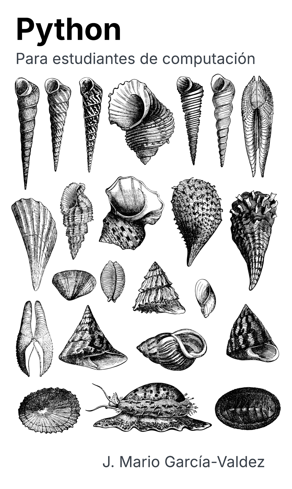

Python para estudiantes de computación
=======================================

Análisis de Datos, Computación Inteligente, Cómputo Distribuido y Servicios Web
-------------------------------------------------------------------------------

**José Mario García Valdez**

Este libro presenta los fundamentos del lenguaje Python y su aplicación al
análisis de datos, la computación inteligente, el cómputo distribuido y el
desarrollo de servicios web. Está dirigido principalmente a estudiantes de
computación que desean avanzar desde los conceptos básicos hasta la creación
de soluciones prácticas.

.. raw:: latex
   
   \frontmatter

.. toctree::
   :maxdepth: 1
   :caption: Presentación

   contribución_académica
   agradecimientos
   prefacio

.. raw:: latex

    \sphinxtableofcontents

.. raw:: latex

    \mainmatter

.. toctree::
   :numbered: 2
   :maxdepth: 1
   :caption: Contenido
   :name: mastertoc

   fundamentos
   funcional
   strings
   archivos
   oop
   módulos
   venv
   sql
   datapy
   scikitlearn
   fuzzy
   ga
   distribuido
   web

.. raw:: latex

   \appendix

.. toctree::
   :numbered: 4
   :maxdepth: 1
   :caption: Apéndices

   instalación
   controlador
   controlpso
   bibliografía
