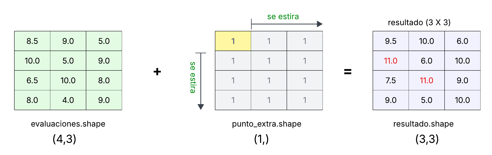
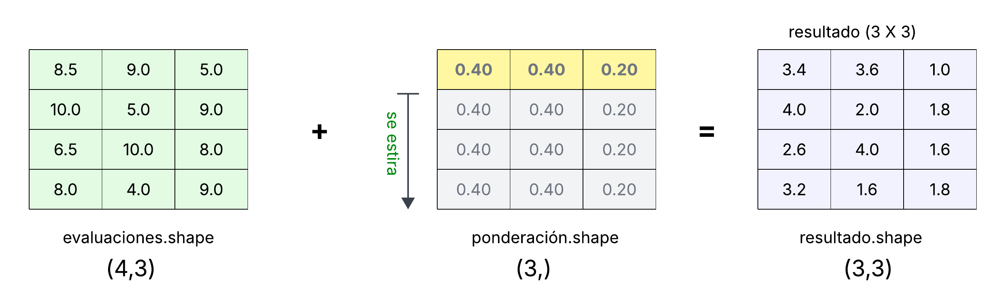
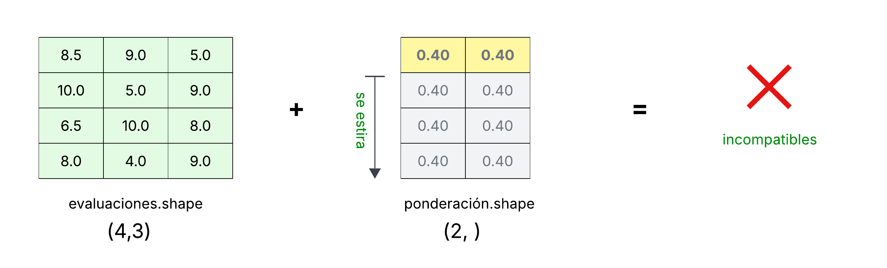
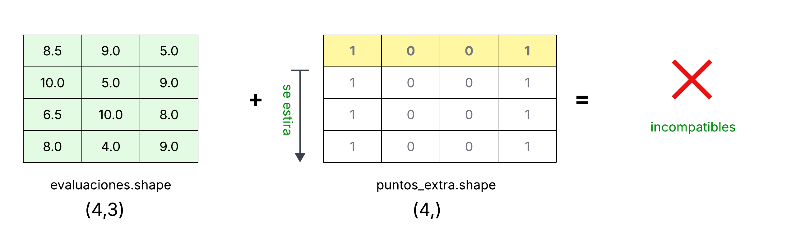
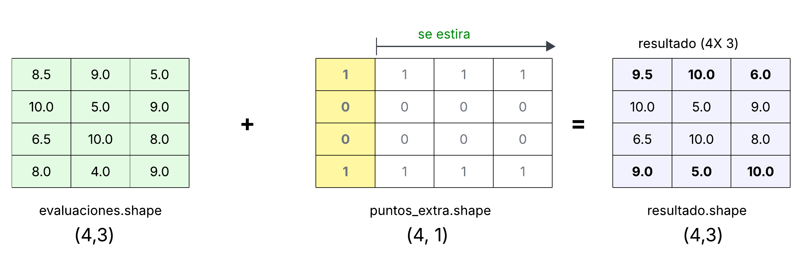

.. role:: python(code)
   :language: python

.. _datapy: 

Estructuras de datos para análisis numérico y tabular
=====================================================

En los capítulos anteriores hemos trabajado con distintos enfoques para manejar
datos en Python. Vimos cómo representar datos mediante **estructuras nativas de Python**
(listas, diccionarios y tuplas), y cómo aplicar **programación funcional** para
expresar transformaciones de manera concisa y declarativa. Además, consideramos
el uso de bases de datos relacionales transaccionales y así como las denominadas NoSQL. 

Aunque estas herramientas son fundamentales, para la gestión de datos de
propósito general, en áreas de ingeniería y ciencias computacionales también
requerimos herramientas para realizar operaciones numéricas y estadísticas de
forma eficiente. Para esto, necesitamos representaciones que permitan trabajar
con datos de manera vectorizada, minimizar el uso de ciclos explícitos y servir
como base para algoritmos de aprendizaje automático.

En Python, estas necesidades están cubiertas principalmente por las bibliotecas
**NumPy** y **pandas**. NumPy introduce arreglos numéricos homogéneos diseñados
para el cómputo científico eficiente, mientras que pandas amplía estas
capacidades para trabajar con datos tabulares heterogéneos, incorporando
etiquetas, soporte para valores faltantes y operaciones de alto nivel orientadas
al análisis de datos.

Este capítulo funciona como un puente natural hacia el aprendizaje
automático. Las estructuras y operaciones que aquí se presentan constituyen
la base sobre la cual se construyen bibliotecas como **scikit-learn**, que
asume que los datos ya han sido limpiados, transformados y organizados en formas
adecuadas para el entrenamiento de modelos.

NumPy
*****

Cómputo numérico en Python
--------------------------

Durante más de cincuenta años, `Fortran <https://fortran-lang.org/>`_  ha sido
el lenguaje estándar del cómputo científico y de alto rendimiento. Las
librerías `BLAS <https://es.wikipedia.org/wiki/Basic_Linear_Algebra_Subprograms>`_ (en realidad,
una especificación) y `LAPACK <https://es.wikipedia.org/wiki/LAPACK>`_,
escritas en Fortran, continúan siendo la referencia cuando se trata de hacer
operaciones vectoriales y matriciales. Incluso, herramientas comerciales como
`MATLAB <https://en.wikipedia.org/wiki/MATLAB>`_, se basan en estas librerías
pero ofreciendo una interfaz de programación más amigable. La desventaja es
que crean una dependencia del proveedor y van en contra de las prácticas de 
**ciencia abierta** que nos interesa promoveer.

La tendencia actual de la comunidad científica es migrar hacia alternativas de sofware libres como 
`GNU Octave <https://octave.org/>`_ o `SageMath <https://www.sagemath.org/>`_, 
y hacia lenguajes de programación abiertos, diseñados para el análisis 
numérico (`Julia <https://julialang.org/>`_) o estadístico (`R <https://www.r-project.org/>`_).
En este panorama, *Python* se ha 
consolidado como uno de los lenguajes más utilizados gracias a su sencillez, 
su comunidad y su creciente ecosistema científico. Este éxito se debe en gran medida al esfuerzo inicial  
de los autores de proyectos de código abierto
`SciPy <https://scipy.org/>`_, `Matplotlib <https://matplotlib.org/>`_, y `NumPy <https://numpy.org/>`_ .

NumPy, en particular, introdujo un tipo de dato fundamental: el arreglo
multidimensional ``ndarray``. Este arreglo (o matriz), junto con sus operaciones
vectorizadas permitió que Python alcanzara el rendimiento
necesario para aplicaciones científicas y de ingeniería.

NumPy nos proporciona:

* Un tipo de dato eficiente para arreglos *n-dimensionales* (``ndarray``).
* Operaciones vectorizadas implementadas en C/Fortran para mejorar el rendimiento.
* Funciones de *álgebra lineal*, transformadas de Fourier y generación 
  de números aleatorios. 

* *Broadcasting*, para operar arreglos de diferentes formas.
* Integración con código en C, C++ y Fortran.
* Licencia abierta *BSD*, compatible con la ciencia abierta.

.. tip::

        Si te interesa conocer más sobre la historia de la librería NumPy, no te pierdas el documental 
        *The early days of scientific Python with Travis Oliphant* disponible 
        en `YouTube <https://www.youtube.com/watch?v=-xhai2iu_QY>`_.

``ndarray``
-----------

Mientras que en Python contamos con colecciones de objetos tipo secuencia, como
las listas, éstas no tienen una estructura adecuada para realizar operaciones
numéricas generales. Por ejemplo, si tenemos la siguiente lista de listas:

.. code-block:: python

    >>> lista_objetos = [[1, 2, 3],
    ...                  [2, 2],
    ...                  ['Hola', 11],
    ...                  [2]]

Tenemos dos problemas importantes:

1. **Las sublistas tienen diferente tamaño.**  
   Unas tienen tres elementos, otras dos y una solo uno. Esto
   impide realizar operaciones posición por posición, como sumar todos los valores de
   la tercera columna ya que algunas sublistas no tienen el tercer
   elemento.

2. **Los elementos no son del mismo tipo.**  
   La tercera sublista contiene una cadena:

   .. code-block:: python

       ['Hola', 11]

   Esto hace imposible sumar todos los elementos de la primera posición, ya 
   Python no puede sumar enteros con cadenas de texto.

Estas limitaciones hacen que las listas de Python no sean una buena
representación para datos numéricos estructurados. Para análisis científico,
necesitamos estructuras que:

- tengan forma regular (todas las filas con el mismo número de columnas),  
- contengan datos homogéneos,  
- permitan operaciones vectorizadas eficientes.

Aquí es donde entra **NumPy** y su tipo de dato fundamental: el arreglo
multidimensional ``ndarray``.

Vamos a crear una lista compatible con un ``ndarray``:

.. code-block:: python

        >>> import numpy as np
        >>> listas  = [[2,3,4], [3,6,8], [2,3,4]]
        >>> listas
        [[2, 3, 4], [3, 6, 8], [2, 3, 4]]

Python nos permite crear arreglos ``ndarray`` a partir de listas u otras secuencias de
Python. En este ejemplo, la secuencia contiene otras secuencias internas, ya que
tenemos una *lista de listas*. En estos casos NumPy interpreta esta estructura como un arreglo
bidimensional.

.. code-block:: python

        >>> arreglo_np = np.array(listas)
        >>> arreglo_np
        array([[2, 3, 4],
               [3, 6, 8],
               [2, 3, 4]])

Lo primero que notamos es que al desplegar el arreglo este se imprime con un formato
de matriz, donde cada sublista se convierte en un renglón del arreglo. 

Notación de cortes
------------------

Podemos acceder a los renglones o columnas de un arreglo bidimensional utilizando la
notación de cortes (*slicing*) de Python.   
NumPy extiende esta notación permitiendo especificar un corte para cada dimensión del
arreglo con la sintaxis ``arreglo[renglón, columna]``.

Por ejemplo, para imprimir toda la primer columna utilizamos:

>>> arreglo_np[:, 0]
array([2, 3, 2])

En este caso, indicamos que queremos todos los renglones ``:`` pero solo la
columna ``0``. Recuerda que el símbolo ``:`` representa un corte completo, es
decir, “todas las posiciones” en esa dimensión.

De la misma manera, podemos obtener un renglón completo utilizando la misma
notación de cortes. Ahora vamos a imprimir los primeros dos elementos del 
primer renglón:

.. code-block:: python

    >>> arreglo_np[0, :2]
    array([2, 3])

Vemos que es exactamente la misma notación de cortes (*slicing*) utilizada en listas
de Python, pero ahora aplicada a las dimensiones del arreglo bidimensional.
Esta manera de indexar es muy poderosa y la utilizaremos continuamente cuando
trabajemos con datos numéricos y operaciones matriciales en NumPy.

Copias y vistas
----------------
Algo muy importante al trabajar con arreglos ``ndarray`` es que, en la mayoría
de los casos, los cortes (*slices*) no generan una copia del arreglo, sino una
*vista* (*view*). Una vista comparte la misma memoria con el arreglo original,
por lo que cualquier modificación hecha a la vista afecta directamente al
arreglo original.

Veamos un ejemplo:

.. code-block:: python

    >>> a = np.array([1, 2, 3, 4, 5])
    >>> b = a[1:4]   # Regresa una vista
    >>> b
    array([2, 3, 4])

Modificamos la vista:

.. code-block:: python

    >>> b[0] = 99
    >>> b
    array([99, 3, 4])

El arreglo original también cambió:

.. code-block:: python

    >>> a
    array([1, 99, 3, 4, 5])

Esto sucede porque ``b`` no tiene sus propios datos, sino que es una referencia al
mismo bloque de memoria de ``a``. NumPy utiliza este comportamiento para
evitar copias innecesarias y mejorar el rendimiento.

Si necesitamos explícitamente una copia independiente del arreglo, debemos usar
``copy()``:

.. code-block:: python

    >>> c = a[1:4].copy()
    >>> c[0] = -5
    >>> c
    array([-5,  3,  4])
    >>> a
    array([1, 99, 3, 4, 5])  # El original ya no cambia

Funciones para crear arreglos 
-----------------------------

En ocasiones queremos crear arreglos con datos iniciales sin necesidad de
proporcionar explícitamente cada elemento. NumPy incluye varias funciones
con este propósito, entre ellas ``zeros()``, ``ones()`` y ``empty()``.

Podemos crear un arreglo lleno de ceros especificando su forma (*shape*) como
una tupla:

.. code-block:: python

    >>> np.zeros((3, 4))
    array([[0., 0., 0., 0.],
           [0., 0., 0., 0.],
           [0., 0., 0., 0.]])

De manera similar, ``ones()`` crea un arreglo en el que todos los elementos
son uno. El siguiente ejemplo crea un arreglo tridimensional:

.. code-block:: python

    >>> np.ones((2, 3, 4))
    array([[[1., 1., 1., 1.],
            [1., 1., 1., 1.],
            [1., 1., 1., 1.]],

           [[1., 1., 1., 1.],
            [1., 1., 1., 1.],
            [1., 1., 1., 1.]]])

La función ``empty()`` crea un arreglo con la forma indicada pero **sin
inicializar** sus valores; es decir, contiene lo que sea que hubiera en la
memoria en ese momento:

>>> np.empty((3,))
array([7.74860419e-304, 7.74860419e-304, 7.74860419e-304])

.. note::

        Es importante recordar que ``empty()`` no llena el arreglo con ceros;
        el contenido depende del estado de la memoria asignada y, por lo tanto,
        **no se debe utilizar cuando necesitemos valores iniciales
        confiables**.

Tipos de datos
--------------

Es importante considerar el tipo de dato (`dtype
<https://numpy.org/doc/stable/user/basics.types.html>`_) de los elementos del
arreglo. Podemos imprimir el tipo de dato asignado por el constructor ``array``
con el atributo ``dtype``:

>>> arreglo_np.dtype
dtype('int64')

Tambien podemos especificar explícitamente el tipo de dato en el contructor:

>>> arreglo_8 = np.array(listas, dtype=np.int8)
>>> arreglo_8
array([[2, 3, 4],
       [3, 6, 8],
       [2, 3, 4]], dtype=int8)

En este caso utilizamos enteros con signo de 8 bits, lo que 
nos permite representar enteros de ``-120`` a ``127``. Si 
se intentara incluir un entero fuera de este rango, el 
constructor lanzaría una excepción.

Rank y Shape
------------

Veamos que pasa si enviamos una lista heterogénea al constructor de `ndarray`:

>>> objetos = [[1, 3.4], ['Hola'], [2, 3, 4]]
>>> arreglo = np.array(objetos)
Traceback (most recent call last):
  File "<stdin>", line 1, in <module>
ValueError: setting an array element with a sequence. The requested array has 
an inhomogeneous shape after 1 dimensions. The detected shape was (3,) + inhomogeneous part.

NumPy intenta crear un arreglo bidimensional, pero las sublistas no tienen la
misma longitud; por lo tanto, la estructura no es rectangular y se produce un
error. Aunque normalmente no es útil, podemos construir un arreglo unidimensional
de elementos tipo ``object``:

>>> arreglo = np.array(objetos, dtype=object)
>>> arreglo
array([list([1, 3.4]), list(['Hola']), list([2, 3, 4])], dtype=object)

Este no es un arreglo muy útil para cómputo numérico. 
Mejor vamos a crear un arreglo unidimensional de enteros:

>>> enteros = np.array([1,3,4,5,7])
>>> enteros
array([1, 3, 4, 5, 7])
>>> enteros.dtype
dtype('int64')

Comparemos la dimension de los arreglos utilizando el atributo `ndim`:

>>> enteros.ndim
1

>>> arreglo_np.ndim
2

El número de dimensiones se conoce en NumPy como el *rank* (rango) del arreglo.

Otro atributo importante es la forma (*shape*) del arreglo, que indica el número
de elementos en cada dimensión:

>>> arreglo_np.shape
(3, 3)
>>> enteros.shape
(5,)

Para un arreglo bidimensional, el primer valor de la tupla corresponde al número
de renglones y el segundo al número de columnas. Una forma útil de recordarlo es
pensar en cómo se asignan los asientos en el cine: primero se indica la fila
(renglón) y después el número de asiento (columna).

Operaciones en arreglos 
-----------------------

Para esta sección consideremos la siguiente lista de calificaciones, donde cada alumno tiene
tres evaluaciones: examen, tarea y participación. Todas las calificaciones están en el
rango de 0 a 10.

+----+----------------+--------+--------+----------+
| id | nombre         | tarea  | examen | proyecto |
+====+================+========+========+==========+
| 1  | Joe            | 8.5    | 9.0    |  5.0     |
+----+----------------+--------+--------+----------+
| 2  | Ana            | 10.0   | 5.0    | 9.0      |
+----+----------------+--------+--------+----------+
| 3  | Tom            | 6.5    | 10.0   | 8.0      |
+----+----------------+--------+--------+----------+
| 4  | Zoe            | 8.0    | 4.0    | 9.0      |
+----+----------------+--------+--------+----------+

Vamos a almacenar las evaluaciones en un arreglo de NumPy, en este punto 
vamos a dejar fuera tanto el ``id`` como el ``nombre`` del alumno. Dejamos fuera 
estos datos ya que NumPy está optimizado para operar sobre
datos numéricos homogéneos, por lo que mezclar identificadores o cadenas de
caracteres en el mismo arreglo rompería esta regla y haría menos eficientes las operaciones
vectorizadas.

.. note::

        Más adelante podremos conservar estos datos *DataFrames* en pandas,
        pero el arreglo principal de NumPy debe permanecer exclusivamente numérico para
        que su uso sea óptimo.

Creamos ahora el arreglo ``evaluaciones`` utilizando únicamente los datos
numéricos. Cada renglón corresponde a un alumno y cada columna a una de las
tres evaluaciones (tarea, examen y proyecto):

.. code-block:: python

    >>> import numpy as np

    >>> evaluaciones = np.array([
    ...     [8.5,  9.0,  5.0],
    ...     [10.0, 5.0,  9.0],
    ...     [6.5, 10.0,  8.0],
    ...     [8.0,  4.0,  9.0]
    ... ])
    >>> evaluaciones
    array([[ 8.5,  9. ,  5. ],
           [10. ,  5. ,  9. ],
           [ 6.5, 10. ,  8. ],
           [ 8. ,  4. ,  9. ]])

Podemos inspeccionar la forma (*shape*) del arreglo para confirmar su estructura:

.. code-block:: python

    >>> evaluaciones.shape
    (4, 3)

Esto nos indica que tenemos **4 alumnos** y **3 evaluaciones** por alumno.

También podemos verificar el tipo de dato que le asignó NumPy:

.. code-block:: python

    >>> evaluaciones.dtype
    dtype('float64')

Sobre estos arreglos ahora si podemos aplicar operaciones vectorizadas. 
En el caso de las evaluaciones podemos calcular: promedios, máximos, mínimos,  
normalización y muchas otras operaciones de análisis numérico.
Veamos algunos ejemplos.

Para empezar, podemos ver las calificaciones de ``Joe`` y calcular su promedio utilizando
*slicing*. Recordemos que ``Joe`` corresponde al primer renglón del arreglo
(índice ``0``):

.. code-block:: python

    >>> evaluaciones[0, :]
    array([8.5, 9. , 5. ])

También podemos acceder al primer renglón del arreglo utilizando únicamente un
índice:

.. code-block:: python

    >>> evaluaciones[0]
    array([8.5, 9. , 5. ])

Cuando proporcionamos solo un índice a un arreglo bidimensional, NumPy asume
que nos referimos al renglón completo correspondiente a ese índice. Por lo
tanto, ``evaluaciones[0]`` es equivalente a escribir ``evaluaciones[0,:]``.

Ahora, para calcular el promedio de sus evaluaciones, simplemente aplicamos el
método ``mean`` sobre su renglón:

.. code-block:: python

    >>> evaluaciones[0, :].mean()
    7.5

NumPy realiza esta operación de manera vectorizada, sin necesidad de escribir
ciclos explícitos. Esta es una de las razones por las que es tan eficiente para
el análisis numérico.

Operaciones elemento por elemento
---------------------------------

Cuando utilizamos operaciones aritméticas sobre arreglos, la operación se realiza
para cada elemento (*element-wise*) y se regresa un nuevo arreglo con el
resultado. NumPy aplica estas operaciones de manera vectorizada, sin necesidad
de escribir ciclos explícitos.

Por ejemplo, supongamos que debido al buen desempeño de todos los alumnos se
decide subir un punto a todas las calificaciones:

.. code-block:: python

    >>> evaluaciones + 1
    array([[ 9.5, 10. ,  6. ],
           [11. ,  6. , 10. ],
           [ 7.5, 11. ,  9. ],
           [ 9. ,  5. , 10. ]])

La operación ``+ 1`` se aplica a cada elemento del arreglo y NumPy regresa un
nuevo arreglo con los valores actualizados. El operador de adición es un alias
de la función ``numpy.add``. Esta función toma dos arreglos como operandos y
aplica la operación elemento a elemento. Cuando realizamos:

.. code-block:: python

    >>> evaluaciones + 1

el valor ``1`` se interpreta como un arreglo muy pequeño cuya forma es
compatible con la operación. NumPy realiza un proceso llamado *broadcasting*,
que consiste en ampliar de manera conceptual el arreglo más pequeño para que
coincida con la forma del arreglo más grande, sin copiar datos innecesariamente.

En otras palabras, NumPy "extiende" el escalar ``1`` para que actúe sobre cada
elemento de ``evaluaciones``, gráficamente la extensión virtual se vería así:

.. attention::
   Hay un detalle en nuestra operación. Al hacer la operación en todo el arreglo 
   varias evaluaciones superan la calificación máxima de diez. Resolveremos este problema 
   como ejercicio.

Siguiendo con el ejemplo, ahora vamos a suponer que deseamos aplicar una ponderación distinta a cada
actividad. Por ejemplo, podríamos asignar un 40% a la tarea, 40% al examen y
20% al proyecto:

.. code-block:: python

    >>> ponderacion = np.array([0.40, 0.40, 0.20])
    >>> ponderacion
    array([0.4, 0.4, 0.2])

Si multiplicamos el arreglo ``evaluaciones`` por el arreglo ``ponderacion``, NumPy
aplica la operación elemento a elemento. En este caso los arreglos tienen formas
compatibles: ``evaluaciones`` es de forma ``(4, 3)`` y ``ponderacion`` es de forma
``(3,)``. De nuevo NumPy utiliza *broadcasting* para extender la ponderación a cada renglón:

.. code-block:: python

    >>> evaluaciones * ponderacion
    array([[3.4 , 3.6 , 1.  ],
           [4.  , 2.  , 1.8 ],
           [2.6 , 4.  , 1.6 ],
           [3.2 , 1.6 , 1.8 ]])

En este caso, la ponderación se aplica correctamente a cada una de las tres
actividades para todos los alumnos. Este tipo de operación es muy eficiente,
porque NumPy no hace copias adicionales; simplemente extiende de manera
conceptual el arreglo ``ponderacion`` para que sea compatible con ``evaluaciones``.

Como ejemplo, vamos a suponer que no agregamos una ponderación para la evaluación del proyecto:

>>> ponderacion = np.array([0.40, 0.40])
>>> ponderacion.shape
(2,)

En este caso no podemos hacer la multiplicación elemento por elemento, ya 
que no es posible obtener dos arreglos compatibles (con la misma forma) 
estirando alguno de ellos:

``numpy.newaxis``
-----------------

En algunos casos debemos agregar una dimensión adicional a nuestros arreglos
para que estos sean compatibles. Veamos un ejemplo. 

De nuevo vamos dar un punto extra a los alumnos, pero solo a algunos.
Para especificar a que alumnos daremos un punto extra utilizaremos un 
arreglo de una dimensión con cuatro elementos, indicando el valor que 
sumaremos al las evaluaciones de cada alumno:

>>> puntos_extra = np.array([1,0,0,1])
>>> puntos_extra
array([1, 0, 0, 1])
>>> puntos_extra.shape
(4,)

Gráficamente podemos observar que el arreglo ``evaluaciones`` no es compatible 
con ``puntos_extra``:

Podemos ver gráficamente una manera de solucionar este problema:

La solución es cambiar el arreglo de una dimensión a dos dimensiones con 
forma ``4 x 1``. Para esto utilizaremos la constante ``np.newaxis`` dentro de la
operación de indexado:

Primero vamos la forma actual:

>>> puntos_extra.shape
(4,)

Si agregamos ``np.newaxis`` en el primer índice se 
crea una arreglo con forma ``(1, 4)``:

>>> puntos_extra[np.newaxis, :]
array([[1, 0, 0, 1]])
>>> puntos_extra[np.newaxis, :].shape
(1, 4)

Esto nos da un arreglo similar al que tenemos,
pero ahora es un renglon con cuatro columnas.

Probemos agregando la constante en el segundo índice:

>>> puntos_extra[:, np.newaxis]
array([[1],
       [0],
       [0],
       [1]])
>>> puntos_extra[:, np.newaxis].shape
(4, 1)

Esto es lo que necesitamos. Ahora podemos hacer la operación sin 
problema:

>>> puntos_extra[:, np.newaxis]  +  evaluaciones
array([[ 9.5, 10. ,  6. ],
       [10. ,  5. ,  9. ],
       [ 6.5, 10. ,  8. ],
       [ 9. ,  5. , 10. ]])

Utilizar la constante ``np.newaxis`` es equivalente a utilizar ``None``,
por lo que a veces lo veremos expresado de esta manera:

>>> puntos_extra[:, None]
array([[1],
       [0],
       [0],
       [1]])

El parámetro ``axis``
---------------------

Para obtener el promedio ponderado final de cada alumno sumamos los valores de
cada renglón. NumPy puede hacerlo de manera vectorizada:

.. code-block:: python

    >>> (evaluaciones * ponderacion).sum(axis=1)
    array([8. , 7.8, 8.2, 6.6])

Esto lo hacemos aplicando la función suma a los elementos del eje
correspondiente. Al utilizar ``axis=1`` indicamos que la suma debe realizarse a
lo largo de cada renglón, es decir, sumamos las actividades de cada alumno para
obtener su promedio ponderado.

Esto produce un arreglo unidimensional donde cada entrada corresponde al
promedio ponderado de un alumno.

- Joe obtiene **8.0**  
- Ana obtiene **7.8**  
- Tom obtiene **8.2**  
- Zoe obtiene **6.6**

Nótese que no necesitamos escribir ciclos; NumPy realiza la operación de manera
eficiente mediante operaciones vectorizadas y *broadcasting*.

De manera análoga, si deseamos calcular el promedio de calificación por
actividad (tarea, examen y proyecto), debemos sumar a lo largo del eje ``0``,
es decir, por columnas. Después dividimos entre el número de alumnos o, de
forma más conveniente, utilizamos directamente la función ``mean``:

.. code-block:: python

    >>> evaluaciones.mean(axis=0)
    array([8.25, 7.0 , 7.75])

Esto nos da:

- promedio de **tarea**: 8.25  
- promedio de **examen**: 7.0  
- promedio de **proyecto**: 7.75  

Aquí ``axis=0`` indica que la operación se aplica columna por columna, lo que
corresponde a obtener el promedio de cada actividad considerando a todos los
alumnos.

Ejemplo: Cuantización Vectorial de Colores RGB
---------------------------------------------

En la documentación oficial de NumPy se describe un ejemplo del uso de arreglos 
para un caso del mundo real de *Cuantización Vectorial*. Vamos a adaptar esta
idea al caso de colores en formato RGB.

Cada color se puede representar como un vector en :math:`\mathbb{R}^3` con tres
componentes: rojo (R), verde (G) y azul (B). Por ejemplo, el color rojo puro
sería el vector ``[255, 0, 0]``.

Supongamos que tenemos una pequeña “imagen” formada por 6 píxeles, cada uno con
un color RGB:

.. code-block:: python

    >>> import numpy as np

    >>> imagen = np.array([
    ...     [123,  20,  18],   # píxel 0
    ...     [200, 180, 170],   # píxel 1
    ...     [ 10, 220,  30],   # píxel 2
    ...     [  5,  10, 200],   # píxel 3
    ...     [250, 250, 250],   # píxel 4
    ...     [ 80,  80,  80]    # píxel 5
    ... ], dtype=float)

Ahora definimos una pequeña *paleta* de colores prototipo. Estos serán los
colores “permitidos” después de la cuantización:

.. code-block:: python

    >>> paleta = np.array([
    ...     [255,   0,   0],   # rojo
    ...     [  0, 255,   0],   # verde
    ...     [  0,   0, 255],   # azul
    ...     [255, 255, 255]    # blanco
    ... ], dtype=float)

Queremos asignar cada píxel de la imagen al color de la paleta *más cercano*
usando la distancia euclidiana.

Primero calculamos la diferencia entre cada píxel y cada color de la paleta.
Utilizamos *broadcasting* para evitar ciclos explícitos:

.. code-block:: python

    >>> dif = imagen[:, np.newaxis, :] - paleta[np.newaxis, :, :]
    >>> dif.shape
    (6, 4, 3)

El arreglo ``dif`` tiene forma ``(6, 4, 3)``:

- 6 píxeles,
- 4 colores en la paleta,
- 3 componentes (R, G, B).

Calculamos ahora la distancia euclidiana a lo largo del último eje:

.. code-block:: python

    >>> distancias = np.linalg.norm(dif, axis=2)
    >>> distancias
    array([[134.71451295, 265.85334303, 267.76482219, 358.91224554],
           [253.62373706, 272.99267389, 282.17902119, 125.99603168],
           [330.64331235,  47.16990566, 314.84122983, 334.47720401],
           [320.31234756, 316.30681308,  56.1248608 , 354.33035433],
           [353.58874416, 353.58874416, 353.58874416,   8.66025404],
           [208.38665984, 208.38665984, 208.38665984, 303.10889132]])

Cada renglón corresponde a un píxel y cada columna a un color de la paleta.

Para saber qué color asignar a cada píxel, tomamos el índice del menor valor
en cada renglón:

.. code-block:: python

    >>> asignacion = distancias.argmin(axis=1)
    >>> asignacion
    array([0, 3, 1, 2, 3, 0])

Con esta información construimos la versión cuantizada de la imagen, donde cada
píxel se reemplaza por su color prototipo más cercano:

.. code-block:: python

    >>> imagen_cuantizada = paleta[asignacion]
    >>> imagen_cuantizada
    array([[255.,   0.,   0.],
           [255., 255., 255.],
           [  0., 255.,   0.],
           [  0.,   0., 255.],
           [255., 255., 255.],
           [255.,   0.,   0.]])

Hemos realizado una versión sencilla de *cuantización vectorial* de colores:
cada vector RGB original se ha aproximado por el color de la paleta más
cercano. Este mismo patrón se usa en problemas reales de compresión de imágenes
y reducción de colores, y ilustra muy bien la potencia de las operaciones
vectorizadas y el *broadcasting* en NumPy.

Pandas
******

En la sección anterior trabajamos con arreglos ``ndarray`` de NumPy. Vimos que
son estructuras muy eficientes para representar datos numéricos en una o varias
dimensiones, con tipos de datos homogéneos (el mismo tipo en todo el arreglo),
y operaciones vectorizadas. Sin embargo, cuando trabajamos con datos del mundo
real preferimos organizar los datos en forma de tablas. Las tablas pueden tener
diferentes tipos de datos en cada columna, nos referimos a las columnas por su
nombre y a los registros por algún identificador. Podríamos almacenar estos
datos en arreglos de NumPy, pero con algunas limitantes:

- mezclar tipos de datos en un mismo ``ndarray`` es complicado e ineficiente,
- hay que utilizar varios arreglos para dar nombres a renglones y columnas,
- realizar operaciones que encontramos en SQL, como agrupar, filtrar por valores
  categóricos o combinar tablas, no es tan fácil utilizando ``ndarray``.

Aquí es donde entra **pandas**.

Pandas está construido sobre NumPy y utiliza arreglos ``ndarray`` para
gestionar los datos numéricos internamente, pero añade una capa de abstracción
para el análisis de datos tabulares. Para esto implementa dos estructuras
fundamentales:

- ``Series``: una secuencia unidimensional para procesar series de tiempo.
- ``DataFrame``: una tabla con renglones y columnas etiquetadas, donde cada
  columna puede tener un tipo de dato diferente (numérico, categórico, texto, fechas). 
  Parecido a utlizar hojas de Excel o tablas relaciones.

El ``DataFrame`` 
----------------

En esta sección nos concentraremos en la estructura ``DataFrame`` y veremos cómo:

- cargar datos a un ``DataFrame`` desde archivos de texto (como CSV),
- utilizar el constructor pasándole estructuras de Python ( como listas, diccionarios, arreglos de
  NumPy),
- consultar datos por renglón o columna,
- realizar operaciones básicas de limpieza de datos y análisis estadístico.

Como inicio pensemos que un ``DataFrame``  es como un arreglo de NumPy bidimensioal, 
pero con capacidades adicionales:

- Las columnas y renglones pueden tener nombre (etiqueta).
- También podemos utilizar índices para referirnos a los renglones y las columnas,
- Diseñado pensado en el procesamiento de datos heterogéneos (tipo de dato diferentes).

Creando un ``DataFrame`` desde un archivo de texto
--------------------------------------------------

Como ejemplo, vamos a utilizar una estructura tipo ``DataFrame`` para almacenar
el conjunto de datos conocido como `Auto MPG
<https://archive.ics.uci.edu/ml/datasets/Auto+MPG>`_. Aunque este es un *data set*
viejito, es muy útil para ejemplificar el tipo de operaciones que debemos realizar 
en nuestras tareas de análisis de datos. Al encontrarnos frente a un nuevo conjunto de datos,
lo primero que debemos hacer es revisar el tipo de dato de sus atributos. En este caso:

.. list-table::
   :header-rows: 1

   * - nombre
     - tipo
     - escala
     - descripción
   * - ``mpg``
     - continuo
     - razón
     - millas por galón
   * - ``cylinders``
     - discreto
     - ordinal
     - número de cilindros
   * - ``displacement``
     - continuo
     - razón
     - desplazamiento
   * - ``horsepower``
     - continuo
     - razón
     - caballos de fuerza
   * - ``weight``
     - continuo
     - razón
     - peso en libras (US)
   * - ``acceleration``
     - continuo
     - razón
     - aceleración
   * - ``model_year``
     - discreto
     - razón
     - año de fabricación
   * - ``origin``
     - discreto
     - categórico
     - origen del auto
   * - ``car_name``
     - cadena
     - categórico
     - nombre del auto

Como podemos ver, este conjunto de datos contiene atributos heterogéneos. Tenemos
datos numéricos continuos y enteros, pero también hay cadenas de texto y categorías.
El objetivo original de este conjunto de datos era **predecir el consumo de
combustible en millas por galón (``mpg``)** utilizando los demás atributos como características.

Cargando y explorando el archivo de datos
--------------------------------------------

Vamos a descargar el conjunto de datos desde el `repositorio de machine learning
de la UC Irvine
<https://archive.ics.uci.edu/ml/machine-learning-databases/auto-mpg/>`_. El
archivo que nos interesa se llama ``auto-mpg.data``.

Si abrimos el archivo en un editor de texto, vemos que:

- los campos están separados por espacios en blanco, no por comas como es habitual en archivos CSV,
- el número de espacios entre columnas no es siempre el mismo,
- los valores faltantes están marcados con el símbolo ``?``.

Aquí esta un fragmento del archivo:

.. code-block:: text

   11.0   8   350.0      180.0      3664.      11.0   73  1   "oldsmobile omega"
   20.0   6   198.0       95.0      3102.      16.5   74  1   "plymouth duster"
   21.0   6   200.0        ?        2875.      17.0   74  1   "ford maverick"

Lectura del archivo con ``read_csv``
------------------------------------

Pandas nos brinda un conjunto de herramientas de entrada/salida (*IO tools*)
para leer archivos con distintos formatos: texto, binarios y SQL. En el caso de
texto, el método más utilizado es ``read_csv``, que puede leer no solo archivos
separados por comas, sino también por otros delimitadores.

La documentación de ``read_csv`` contiene muchos parámetros para controlar con
detalle la lectura y el *parsing* del archivo. Aquí utilizaremos sólo algunos de
los más importantes.

Recordemos que en un archivo *CSV* típico los valores de los atributos se
separan por comas. En nuestro archivo ``auto-mpg.data`` la separación se hace
por espacios en blanco, y además el número de espacios no es consistente. Para
leer correctamente este archivo, utilizaremos el parámetro ``sep``, que indica
el separador de campos. Por defecto es la coma ``','``, pero también puede ser
una expresión regular.

En expresiones regulares, la cadena ``'\\s'`` representa cualquier espacio en
blanco (espacios y tabulaciones); el operador ``'+'`` indica “una o más
repeticiones”. Es decir, ``'\\s+'`` significa “uno o más espacios en blanco
seguidos”. Este es el separador que necesitamos.

Primer intento de lectura:

.. code-block:: python

   >>> import pandas as pd
   >>> df = pd.read_csv('datos-ejemplo/auto-mpg.data', sep=r'\s+')
   >>> df.head()
       18.0  8  307.0  130.0   3504.0  12.0  70  1  \
   0   15.0  8  350.0  165.0   3693.0  11.5  70  1
   1   18.0  8  318.0  150.0   3436.0  11.0  70  1
   2   16.0  8  304.0  150.0   3433.0  12.0  70  1
   ...

Cargamos el archivo al objeto ``df`` y al ejecutar método ``df.head()`` 
nos muestra los primeros registros del *data frame*. Aquí  
observamos lo siguiente:

- Logramos separar las columnas utilizando la expresión regular ``'\\s+'``.
- Cada renglón incluye internamente un índice (lo vemos antes de la primera columna)
- Hay un pequeño problema, **los nombres de las columnas no tienen sentido**: pandas asumió
  que el primer renglón del archivo era el encabezado con los nombres de los atributos.
  
Nuestro archivo **no tiene un primer renglón de encabezados**, esto debemos indicarlo 
para corregir el problema.

Indicando que no hay encabezado
~~~~~~~~~~~~~~~~~~~~~~~~~~~~~~~

Para decirle a ``read_csv`` que el archivo **no** incluye encabezados, usamos
el parámetro ``header=None``:

.. code-block:: python

   >>> df = pd.read_csv(
   ...     'datos-ejemplo/auto-mpg.data',
   ...     sep=r'\s+',
   ...     header=None
   ... )
   >>> df.head()
        0  1      2      3       4     5   6  7  \
   0  18.0  8  307.0  130.0  3504.0  12.0  70  1
   1  15.0  8  350.0  165.0  3693.0  11.5  70  1
   2  18.0  8  318.0  150.0  3436.0  11.0  70  1
   ...

   8
   0  chevrolet chevelle malibu
   1          buick skylark 320
   2         plymouth satellite
   ...

Ahora pandas simplemente asigna un índice (0, 1, 2, …) a las columnas. De
hecho, pandas siempre conserva un índice entero interno que nos permite acceder
a columnas y renglones por su posición. Estos índices los vemos a la izquierda
y en la parte superior de la de la impresión en pantalla. Con estos índices,
podemos seleccionar columnas y renglones utilizando su posición con mecanismos
como ``iloc`` que veremos más adelante.

Sin embargo, en un ``DataFrame`` es muy importante etiquetar con un nombre las
columnas ya que esto nos permite referirnos a los atributos por su nombre
permitiendo un análisis de datos más legible y expresivo. El siguiente paso es
asignar nombres descriptivos, de acuerdo con la tabla de atributos que
mostramos anteriormente.

Asignando nombres a las columnas
~~~~~~~~~~~~~~~~~~~~~~~~~~~~~~~~

Podemos asignar los nombres de los atributos utilizando el parámetro ``names``:

.. code-block:: python

   >>> nombres_columnas = [
   ...     'mpg', 'cylinders', 'displacement', 'horsepower',
   ...     'weight', 'acceleration', 'model_year', 'origin', 'car_name'
   ... ]
   >>> df = pd.read_csv(
   ...     'datos-ejemplo/auto-mpg.data',
   ...     sep=r'\s+',
   ...     header=None,
   ...     names=nombres_columnas
   ... )
   >>> df.head()
       mpg  cylinders  displacement horsepower  weight  acceleration  \
   0  18.0          8         307.0      130.0  3504.0          12.0
   1  15.0          8         350.0      165.0  3693.0          11.5
   2  18.0          8         318.0      150.0  3436.0          11.0
   ...

Nos falta revisar qué tipos de datos infirió pandas para cada columna.

Revisando los tipos de datos
----------------------------

Similar a NumPy, podemos ver el tipo de dato de cada columna con el atributo ``dtypes``:

.. code-block:: python

   >>> df.dtypes
   mpg             float64
   cylinders         int64
   displacement    float64
   horsepower       object
   weight          float64
   acceleration    float64
   model_year        int64
   origin            int64
   car_name         object
   dtype: object

Hay un detalle importante: la columna ``horsepower`` aparece como ``object``,
cuando debería ser numérica continua (``float64``). Esto ocurre porque algunos valores
faltantes se representaron en el archivo original con el carácter ``'?'`` y
pandas, al encontrarse con una mezcla de números y cadenas en la misma columna,
prefirió tratarla como ``object``.

Manejando valores faltantes con ``na_values``
---------------------------------------------

Podemos indicar a ``read_csv`` qué valores deben considerarse como “datos no
disponibles” (NaN) utilizando el parámetro ``na_values``. En este caso, queremos
que el símbolo ``'?'`` se interprete como valor faltante:

.. code-block:: python

   >>> df = pd.read_csv(
   ...     'datos-ejemplo/auto-mpg.data',
   ...     sep=r'\s+',
   ...     header=None,
   ...     names=nombres_columnas,
   ...     na_values='?'
   ... )
   >>> df.dtypes
   mpg             float64
   cylinders         int64
   displacement    float64
   horsepower      float64
   weight          float64
   acceleration    float64
   model_year        int64
   origin            int64
   car_name         object
   dtype: object

Ahora sí, todas las columnas numéricas fueron correctamente interpretadas como
valores de punto flotante o enteros. Los valores ``'?'`` se convirtieron en
NaN (*Not a Number*), lo que permitirá aplicar funciones estadísticas sin que
fallen las operaciones.

Especificando tipos de datos con ``dtype``
------------------------------------------

Si queremos un control todavía más fino sobre los tipos de dato, podemos
utilizar el parámetro ``dtype`` para indicar explícitamente el tipo de cada
columna. Esto puede ser útil para ahorrar memoria (por ejemplo utilizando
tipos de 32 bits) o para indicar que ciertas columnas son categóricas:

.. code-block:: python

   >>> df = pd.read_csv(
   ...     'datos-ejemplo/auto-mpg.data',
   ...     sep=r'\s+',
   ...     header=None,
   ...     names=nombres_columnas,
   ...     na_values='?',
   ...     dtype={
   ...         'mpg': 'float32',
   ...         'cylinders': 'int32',
   ...         'displacement': 'float32',
   ...         'horsepower': 'float32',
   ...         'weight': 'float32',
   ...         'acceleration': 'float32',
   ...         'model_year': 'int32',
   ...         'origin': 'int32',
   ...         'car_name': 'category',
   ...     }
   ... )
   >>> df.dtypes
   mpg             float32
   cylinders         int32
   displacement    float32
   horsepower      float32
   weight          float32
   acceleration    float32
   model_year        int32
   origin            int32
   car_name       category
   dtype: object

De esta manera:

- reducimos el uso de memoria al utilizar tipos de 32 bits,
- indicamos que ``car_name`` es una variable categórica.

Un primer resumen estadístico
-----------------------------

Una vez leído correctamente el ``DataFrame``, podemos obtener un resumen
estadístico descriptivo utilizando el método ``describe()``:

.. code-block:: python

   >>> df.describe()
               mpg   cylinders  displacement  horsepower       weight  \
   count  398.0000  398.000000    398.000000   392.00000   398.000000
   mean    23.5146    5.454774    193.425873   104.46939  2970.424561
   std      7.8160    1.701004    104.269859    38.49114   846.841431
   min      9.0000    3.000000     68.000000    46.00000  1613.000000
   25%     17.5000    4.000000    104.250000    75.00000  2223.750000
   50%     23.0000    4.000000    148.500000    93.50000  2803.500000
   75%     29.0000    8.000000    262.000000   126.00000  3608.000000
   max     46.6000    8.000000    455.000000   230.00000  5140.000000

       acceleration  model_year
   count   398.00000  398.000000
   mean     15.56809   76.010048
   std       2.75769    3.697627
   min       8.00000   70.000000
   25%      13.82500   73.000000
   50%      15.50000   76.000000
   75%      17.17500   79.000000
   max      24.80000   82.000000

Por defecto, ``describe()`` muestra estadísticas únicamente para las columnas
numéricas (las columnas categóricas y de texto se omiten). Más adelante veremos
cómo generar resúmenes específicos para variables categóricas.

Este tipo de resumen es muy útil como primer paso en el análisis exploratorio de
datos, ya que permite identificar rangos típicos, valores atípicos y posibles
problemas en los datos.

Datos categóricos
-----------------

Hasta ahora hemos trabajado principalmente con columnas numéricas. Sin embargo,
el conjunto de datos también incluye variables categóricas. En particular, la
columna ``origin`` contiene valores enteros (1, 2 y 3) que representan el país
de origen del automóvil.

Al inspeccionar los nombres de los modelos, inferimos que estos valores
corresponden a:

- ``1`` → ``USA``
- ``2`` → ``Japan``
- ``3`` → ``Germany``

Vamos a mapear estos valores enteros a etiquetas descriptivas y asegurarnos de
que la columna sea de tipo ``category``:

.. code-block:: python

Vamos a mapear estos valores enteros a etiquetas descriptivas y asegurarnos de
que la columna sea de tipo ``category``:

.. code-block:: python

    >>> origin_map = {1: 'USA', 2: 'Japan', 3: 'Germany'}
    >>> df['origin'] = df['origin'].map(origin_map)
    >>> df['origin'] = df['origin'].astype('category')
    >>> df['origin'] = df['origin'].cat.set_categories(['USA', 'Japan', 'Germany'])
    >>> df['origin']

De esta forma, la columna ``origin`` deja de ser un simple código numérico y se
convierte en una variable categórica explícita, lo cual facilita tanto el
análisis como la visualización.

Visualización rápida desde pandas
---------------------------------

Pandas incluye métodos de visualización básicos que se apoyan internamente en
la biblioteca ``matplotlib``. Aunque veremos visualización con más detalle más
adelante, podemos generar gráficas sencillas de forma muy rápida.

Por ejemplo, para ver cuántos autos hay por país de origen, podemos utilizar:

.. code-block:: python

    >>> df['origin'].value_counts().plot(kind='bar')

Una vez creada la gráfica, la mostramos explícitamente:

.. code-block:: python

    >>> import matplotlib.pyplot as plt
    >>> plt.show()

Deberíamos ver una gráfica de barras con la distribución de autos por país de
origen.

.. note::

   Debes cerrar la ventana de la gráfica para liberar el control del intérprete
   y poder continuar ejecutando comandos. Si lo deseas, también puedes guardar
   la figura en un archivo.

Gráficas con múltiples variables
--------------------------------

También podemos explorar relaciones entre varias variables al mismo tiempo.
Por ejemplo, podemos graficar:

- ``weight`` en el eje horizontal,
- ``mpg`` en el eje vertical,
- y utilizar ``horsepower`` como mapa de color.

.. code-block:: python

    >>> df.plot.scatter(
    ...     x='weight',
    ...     y='mpg',
    ...     c='horsepower',
    ...     cmap='viridis'
    ... )
    >>> plt.show()

Este tipo de gráfica permite observar relaciones entre variables numéricas y
detectar patrones interesantes de forma visual.

Puedes experimentar con otros mapas de color disponibles en ``matplotlib``:
https://matplotlib.org/stable/tutorials/colors/colormaps.html

El ejemplo anterior muestra **una de las muchas formas** en que podemos cargar
datos en un ``DataFrame`` de pandas. En este caso utilizamos un archivo de texto
con formato irregular para ilustrar cómo ajustar los parámetros del lector y
resolver problemas comunes al trabajar con datos reales.

Sin embargo, pandas ofrece múltiples mecanismos adicionales para crear
``DataFrames``, entre ellos:

- a partir de estructuras de Python (listas, diccionarios, arreglos de NumPy),
- desde archivos JSON, Excel o bases de datos,
- mediante datos obtenidos de servicios web o APIs.

En la documentación oficial se pueden encontrar estos y otros métodos de
entrada. En lo que sigue, asumiremos que los datos ya están disponibles en un
``DataFrame`` y nos concentraremos en las operaciones de procesamiento y
análisis que constituyen el uso principal de pandas.

Operaciones básicas con ``DataFrame``
------------------------------------

Ya tenemos los datos en un ``DataFrame``, ¿y ahora?  
En esta sección veremos cómo realizar operaciones básicas de inspección,
consulta y manipulación de datos tabulares utilizando pandas.

Trabajaremos con el conjunto de datos *Auto MPG*, ya cargado en un
``DataFrame``:

.. code-block:: python

    >>> import numpy as np
    >>> import pandas as pd

    >>> auto_mpg = pd.read_csv(
    ...     'datos-ejemplo/auto-mpg.data',
    ...     sep='\s+',
    ...     header=None,
    ...     na_values='?',
    ...     names=['mpg','cylinders','displacement','horsepower',
    ...            'weight','acceleration','model_year','origin','car_name'],
    ...     dtype={'mpg':'f4','cylinders':'i4','displacement':'f4',
    ...            'horsepower':'f4','weight':'f4','acceleration':'f4',
    ...            'model_year':'i4','origin':'category','car_name':'category'}
    ... )

    >>> auto_mpg['origin'].cat.categories = ['USA', 'Japan', 'Germany']

Inspección rápida
-----------------

Para ver una muestra de los datos podemos utilizar los métodos ``head()`` y
``tail()``. Por defecto muestran cinco registros, pero podemos indicar cuántos
queremos ver.

.. code-block:: python

    >>> auto_mpg.tail(3)

También es posible inspeccionar los índices y las columnas:

.. code-block:: python

    >>> auto_mpg.index
    >>> auto_mpg.columns

Internamente, pandas almacena los datos numéricos utilizando arreglos de NumPy.
Podemos acceder a ellos explícitamente con:

.. code-block:: python

    >>> auto_mpg.to_numpy()

Ordenamiento
------------

Para ordenar los datos por una o más columnas utilizamos el método
``sort_values()``:

.. code-block:: python

    >>> auto_mpg.sort_values(by='car_name').head()

También es posible ordenar por múltiples columnas:

.. code-block:: python

    >>> auto_mpg.sort_values(by=['origin', 'car_name']).tail()

Selección de datos
------------------

Podemos seleccionar subconjuntos de renglones utilizando *slicing* al estilo de
Python:

.. code-block:: python

    >>> auto_mpg[2:5]

Para seleccionar columnas, podemos usar su nombre directamente:

.. code-block:: python

    >>> auto_mpg.car_name[:3]

O bien, pasar una lista de columnas:

.. code-block:: python

    >>> auto_mpg[['car_name', 'origin', 'model_year']].head()

Selección con ``loc`` e ``iloc``
--------------------------------

Se recomienda utilizar ``loc`` para selección basada en **etiquetas**:

.. code-block:: python

    >>> auto_mpg.loc[3:5, 'mpg':'weight']

A diferencia del *slicing* estándar de Python, este corte **incluye ambas
etiquetas**.

Para selección basada en **posición**, utilizamos ``iloc``:

.. code-block:: python

    >>> auto_mpg.iloc[0:2, 0:2]

En este caso, los cortes funcionan exactamente como en listas y arreglos de
Python.

Operaciones vectorizadas
------------------------

Una de las principales ventajas de pandas es que permite aplicar operaciones
vectorizadas sobre columnas completas. Por ejemplo:

.. code-block:: python

    >>> auto_mpg.mpg.head() * 2

Estas operaciones funcionan sobre datos numéricos, pero no sobre datos
categóricos:

.. code-block:: python

    >>> auto_mpg.origin.head() * 2
    TypeError: Categorical cannot perform the operation *

Para datos de tipo texto, pandas ofrece métodos especializados a través del
atributo ``str``:

.. code-block:: python

    >>> auto_mpg.car_name.str.upper().head()

Filtrado condicional
--------------------

Supongamos que queremos encontrar autos con rendimiento mayor a 40 millas por
galón. Primero generamos una máscara booleana:

.. code-block:: python

    >>> auto_mpg.mpg > 40

Luego usamos esta máscara para filtrar el ``DataFrame``:

.. code-block:: python

    >>> auto_mpg[auto_mpg.mpg > 40].loc[:, 
    ...     ['mpg', 'model_year', 'origin', 'car_name']]

Concatenación
-------------

Podemos combinar varios ``DataFrames`` utilizando ``concat()``. Por ejemplo,
extraemos los autos de Japón y Alemania:

.. code-block:: python

    >>> japon = auto_mpg[auto_mpg.origin == 'Japan']
    >>> alemania = auto_mpg[auto_mpg.origin == 'Germany']

    >>> non_usa = pd.concat([japon, alemania])

Agrupación
----------

Para agrupar datos por una variable categórica utilizamos ``groupby()``:

.. code-block:: python

    >>> auto_mpg.groupby('origin').count().loc[:, 'mpg']

En esta sección vimos cómo trabajar con un ``DataFrame`` una vez que los datos
ya están cargados en memoria. Aprendimos a inspeccionar, ordenar, seleccionar,
filtrar, transformar y agrupar datos, operaciones que constituyen el núcleo del
análisis de datos con pandas.

Resumen
-------

En este capítulo estudiamos las dos estructuras fundamentales para el análisis
de datos en Python: los arreglos ``ndarray`` de NumPy y los ``DataFrame`` de
pandas. NumPy nos permite realizar cómputo numérico eficiente mediante
operaciones vectorizadas, mientras que pandas extiende estas capacidades para
trabajar con datos tabulares heterogéneos.

Estas herramientas son parte fundamental de la mayoría de los flujos
modernos de minería de datos y aprendizaje automático. En el siguiente
capítulo utilizaremos estas estructuras como base para construir, entrenar y
evaluar modelos utilizando la biblioteca **scikit-learn**.
