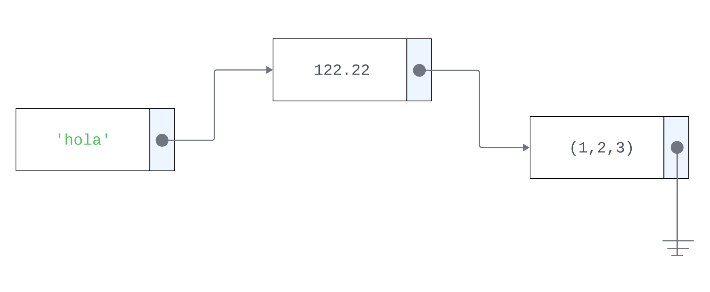
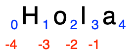
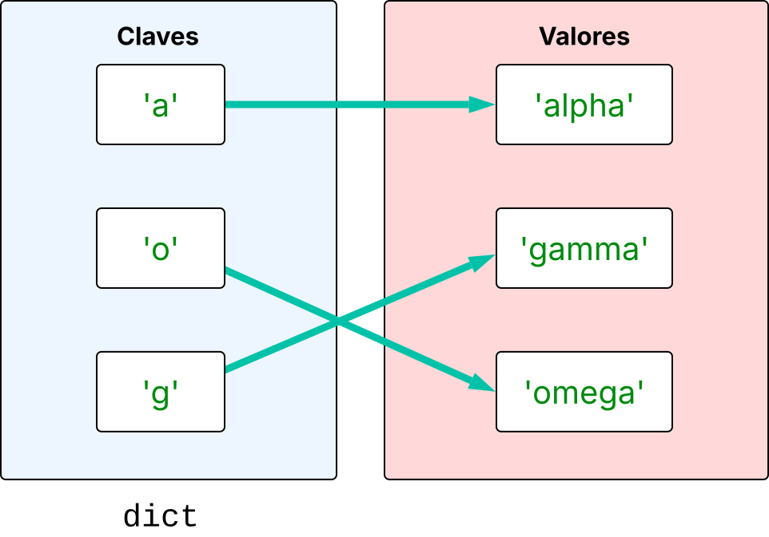
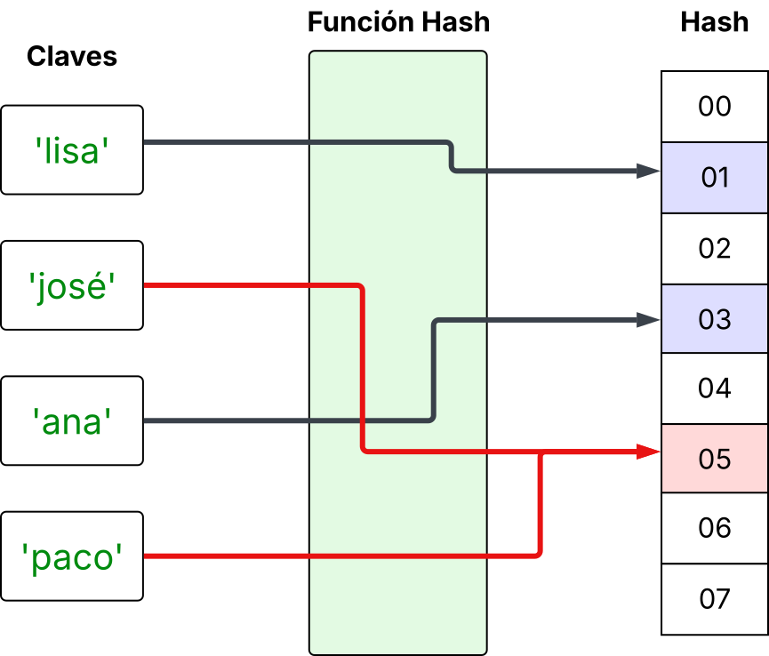

.. _capítulo_02:

.. role:: python(code)
   :language: python

Fundamentos del lenguaje
====================================

Introducción 
------------

El lenguaje Python es un lenguaje interpretado, de propósito general, de código
abierto y multiparadigma que fue diseñado originalmente por el desarrollador
holandés Guido van Rossum a principios de los años noventa. La intención de
Guido era crear un lenguaje de scripts, fácil de programar y que fuera
legible, por lo que se utilizan sangrías para dar
legibilidad al código y estas forman parte del lenguaje. De hecho, el nombre del lenguaje es en honor
al grupo inglés de comedia Monty Python.

Empezemos directamente con un ejemplo de código analizando las diferencias que
vemos respecto a otros lenguajes compilados como *C#* o *Java*:

.. code-block:: python

   x = 34 - 23            # Comentario
   y = "Hola"             # Otro comentario
   z = 3.45

   if z == 3.45 or y == "Hola":
       x = x + 1
       y = y + " Mundo"  # Concatenación de cadenas

   print(x)
   print(y)

Echando un vistazo general al programa, nos llama primero la atención el hecho
de que no se importan algunas librerías al inicio del programa. Por ejemplo,
para la entrada y salida de datos a la consola. También notamos que al declarar
las variables no especificamos explícitamente cuál es su tipo de dato. Tampoco
tenemos que insertar nuestro código en algún método especial como ``main`` o
agregarlo dentro de alguna clase. Funciona como un *script*. Veamos línea por
línea.

.. rubric:: Los nombres se atan a objetos

En la primera línea vemos la declaración de una variable llamada ``x`` a la cual
se le asigna el resultado de una resta entre dos números enteros. Aquí
encontramos la primera diferencia: en Python las "variables" no tienen un tipo de
dato, son simplemente nombres o etiquetas que hacen referencia a objetos. Los
objetos por su parte, sí tienen un tipo de dato. Entonces, en esta línea, el
resultado de la operación se almacena en memoria en una dirección
específica, una referencia. Lo que sucede entonces es que el nombre ``x`` se ata a
la referencia del objeto entero que se crea de la operación :python:`34-23`, el :python:`11` en la memoria.
Esto es distinto al concepto de variable en otros lenguajes. Por ejemplo, en C# las
variables *tipo valor* reservan un espacio en la memoria donde se guarda literalmente el valor 
que contienen, y los valores deben ser del tipo correspondiente. Si yo declaro una 
variable como entera de 16 bits, solo puedo almacenar en ella objetos de este tipo.    

Volviendo al ejemplo, el tipo de dato al que hace referencia el nombre ``x`` después de la asignación,
es temporalmente :python:`int`, pero en otro momento, podríamos
atar el nombre ``x`` a un objeto diferente de otro tipo de dato. Por ejemplo, 
:python:`x = 2.3` o :python:`x = "Hola"`. De nuevo, los objetos en memoria son tipo :python:`float` y :python:`str`
respectivamente y nuestra etiqueta ``x`` se puede atar a cualquiera de ellos sin
ningún problema. Vemos entonces que se atan los nombres ``y`` y ``z`` a la cadena de caracteres
:python:`"Hola"` y al flotante :python:`3.44` respectivamente. 

.. note::

   En este texto utilizo un léxico que debería entender un programador con 
   algo de experiencia. Recuerda que este es el público al que va dirigido el libro. En 
   caso de que haya algunos pocos términos que no tengas claro su significado, no hay problema, 
   investiga un poco y te debería quedar claro.

.. rubric:: Python es dinámico

Algunos programadores pueden ver esta funcionalidad de Python como algo peligroso y
realmente lo es. Podemos equivocarnos fácilmente pensando que ``x`` hace 
referencia a un objeto de tipo entero cuando por algún error puede referirse
a una cadena de caracteres o a un flotante y causar problemas en nuestro código.
El lenguaje nos protege hasta cierto punto ya que lanzará una excepción en caso
de que no esté definida una operación para un tipo de dato específico, pero en
general es algo que debemos tener en cuenta en este tipo de lenguajes dinámicos.

Otro problema que tenemos es que, a diferencia de los lenguajes fuertemente
tipados, nuestras herramientas de programación en ocasiones no pueden ayudarnos
desplegando, por ejemplo, la lista de atributos o miembros de un objeto, ya que 
no sabe a qué tipo de objeto hará referencia el nombre que estamos utilizando.

Otra diferencia importante la encontramos en este bloque de código: 

.. code-block:: python

   if z == 3.45 or y == "Hola":
       x = x + 1
       y = y + " Mundo"  # Concatenación de cadenas
   print(x)
   print(y)

.. rubric:: El espacio es importante

Aquí definimos un bloque que se va a ejecutar si la condición del ``if`` es
verdadera. A diferencia de otros lenguajes, aquí definimos el bloque utilizando
espacios (una sangría). Es común llamarle *indentación* a esta sangría por el
nombre que recibe en inglés. Entonces, el bloque inicia al cambiar la
indentación y debe mantenerse al saltar de línea y termina cuando regresamos la indentación 
al nivel anterior.

.. rubric:: Indentación consistente

En el ejemplo vemos que la condición no tiene indentación, pero el bloque de 
código que se ejecutará en caso de ser verdadera consta de dos líneas. Estas
líneas tienen una indentación consistente de cuatro espacios cada una. Para
terminar el bloque, simplemente escribimos una nueva línea que no contenga los
espacios. Por ejemplo, la instrucción :python:`print(x)`.

.. rubric:: Cuatro espacios es buen estilo

La indentación puede hacerse utilizando la tecla tabulador (tab), pero se
recomienda que no se utilicen caracteres de tabulación y en su lugar se
reemplacen automáticamente por cuatro espacios. Esta es una capacidad que tienen
los editores de código y por lo regular se hace por defecto para los archivos
con extensión  ``.py`` utilizados para los scripts de Python. La convención de
utilizar cuatro espacios la establece la [PEP 8](https://peps.python.org/pep-0008/),
en donde podemos encontrar las convenciones utilizadas por los programadores de las librerías
estándar de la distribución principal de Python. Las siglas PEP vienen del inglés 
*Python Enhancement Proposal* (Propuesta de Mejora para Python). Un PEP es un 
documento público que brinda información a la comunidad sobre alguna nueva
característica o sugerencia de mejora para el lenguaje.

Siguiendo con el código, vemos también que los operadores lógicos (:python:`and`, :python:`or`,
:python:`not`) son palabras y no símbolos como en ciertos lenguajes. Al igual que en la
mayoría de los lenguajes, la concatenación de cadenas de caracteres se hace con
el operador de adición. Para operaciones con otro tipo de objetos, los
operadores (``+ - * /``) funcionan como siempre.

Otra característica importante es que la función para imprimir en la consola es
:python:`print()` y no tuvimos que agregar una librería para acceder a su funcionalidad.
Ya viene de fábrica. De hecho, Python incluye muchas funciones de este tipo
dentro del lenguaje. Utilizaremos muchas de ellas más adelante. 

.. admonition:: Baterías incluidas
   
   Esto es parte del lema de **baterías incluidas** de Python, que se refiere a
   que el lenguaje incluye una extensa y muy útil colección de librerías
   (módulos en Python) en la distribución estándar.

Tipos de datos básicos
-----------------------

**Enteros**

A diferencia de otros lenguajes que incluyen distintos tipos de datos para
representar enteros de distintos tamaños, por ejemplo en C# el tipo de dato
``long`` representa a un entero de 64 bits con signo, mientras que ``short``
representa a un entero con signo de 16 bits. En Python solo tenemos un tipo de
dato entero ``int`` con una precisión arbitraria, capaz de almacenar enteros de
cualquier tamaño. Bueno, el tamaño solo está limitado por la cantidad de
memoria disponible en el sistema. Python evita el desbordamiento asignando
dinámicamente más memoria para almacenar el resultado de una operación entera.
Este costo computacional adicional hace que Python sea apropiado para el cómputo
científico, sacrificando las ventajas en desempeño que supone el tener enteros de
longitud fija.

**Números con punto flotante**

Los números con punto flotante, comúnmente llamados *flotantes* o *floats*,
incluyen un punto decimal y también son de tamaño arbitrario. Se pueden
representar utilizando la notación exponencial (*E*) indicando la décima
potencia. Por ejemplo, :python:`21.3E-4` es equivalente a :python:`21.3 * 10^-4`.

**Cadenas o Strings**

En Python, una cadena o string es una *secuencia* de caracteres. Una *secuencia*
es una abstracción que veremos más adelante, cuando nos enfoquemos en estructuras
de datos; ahí veremos otros aspectos importantes de este tipo de dato. 
Por lo pronto, podemos definir a una cadena como una colección
ordenada de caracteres útil para almacenar texto. Las cadenas se pueden
representar de distintas maneras: utilizando comillas dobles (:python:`"Hola"`),
comillas simples (:python:`'Hola'`) y esto permite evitar cierto tipo de conflictos, por
ejemplo, la cadena :python:`"Carl's Jr."` utiliza comillas dobles para evitar el
conflicto con la comilla simple que es parte del nombre *Carl's*. Cuando tenemos
múltiples párrafos o necesitamos utilizar los dos tipos de comillas en el texto,
utilizamos comillas triples, ya sean dobles o simples:

.. code-block:: python

   """ 
   Este es un ejemplo del uso de 
   comillas triples para definir texto 
   que puede incluir comillas como "Carl's Jr." y 
   saltos de línea. 
       Indentación 
       Indentación 
   """

En otra sección nos vamos a concentrar en la funcionalidad de los objetos tipo *string*;
Python incluye muchos métodos para realizar operaciones sobre este tipo de datos.

**Booleanos**

Los valores de verdad en Python son representados explícitamente con los valores
literales :python:`True` o :python:`False`, verdadero y falso respectivamente, ambos deben
iniciar con mayúscula. El tipo de dato :python:`bool` es un subtipo de :python:`int`, por lo que
en contextos numéricos :python:`True` equivale a uno y :python:`False` a cero
respectivamente. También existen otras formas implícitas de representación de
estos valores de verdad cuando se utilizan operaciones lógicas. Por ejemplo, una
cadena vacía es equivalente a :python:`False` y una colección de datos con cierto número
de elementos es equivalente a :python:`True`. Veremos ejemplos de esto más adelante.

.. rubric:: Comentarios

Python no cuenta con una sintaxis para definir comentarios que abarquen
múltiples líneas. En este caso se pueden utilizar comillas triples para
comentar múltiples líneas. Si un *valor literal* no se asigna a un nombre, este
es ignorado por el intérprete de Python.

Este tipo de comentarios también se utiliza para documentar el código en
situaciones específicas. Por ejemplo, se puede incluir una cadena de
documentación en la primera línea de una función o clase.

.. code-block:: python

   def suma(x, y):
       """El docstring. Esta función 
       regresa la suma o concatenación de dos cadenas, es
       importante ya que blah blah blah."""
       return x + y  # Comentario aquí...

Los comentarios de Python son línea por línea y se especifican con el símbolo de
almohadilla (``#``). En una línea, todo lo que está a la derecha de ``#`` es un
comentario.

.. rubric:: Literales

En los ejemplos anteriores utilizamos *valores literales* de los tipos de datos que 
ilustramos. Es importante reconocer que estos valores representan datos u objetos específicos 
de cierto tipo de dato. Entonces, en los ejemplos anteriores, le definíamos nombres, mediante la 
asignación (o atado) a ellos de un valor literal.

Para terminar esta sección, vamos a representar valores literales de los tipos de datos 
básicos de Python: 

- Entero (:python:`int`): :python:`791926378172346918273469128374619283`, :python:`2`
- Flotante (:python:`float`): :python:`34.3`, :python:`0.33`
- Cadena (:python:`str`)::python:`"Python es un lenguaje dinámico"`, :python:`'Juan'`, :python:`"Leí el libro 'Pedro Páramo'."`
- Booleano (:python:`bool`): :python:`True`, :python:`False`

.. rubric:: El valor especial :python:`None`

La constante :python:`None` es utilizada para indicar la ausencia de valor o un valor nulo. 
Tiene su propio tipo :python:`NoneType`. De manera similar al valor ``NULL`` en bases de datos,
el valor :python:`None` no es igual a cero, :python:`False` o vacío, aunque se considera :python:`False` en 
condiciones booleanas. Se puede utilizar para definir un nombre que no hace referencia 
a un objeto todavía. Por ejemplo:

.. code-block:: python

   x = None 
   print(x)

En este caso ``x`` existe aunque el objeto al que está atado es :python:`None`. Esto
significa que no está atada a un valor todavía. El intérprete no imprime nada
cuando imprimimos :python:`None`.

Funciones
---------

En esta sección veremos cómo definir funciones en Python. Estas nos permiten
crear abstracciones funcionales que nos permiten descomponer las tareas
involucradas en la resolución de problemas complejos. En Python no es necesario
que las funciones estén declaradas como miembros de una clase, como sucede en
los lenguajes orientados a objetos puros. Podemos definirlas de manera
independiente e incluso programar en Python siguiendo un paradigma funcional.

Definición de una función
^^^^^^^^^^^^^^^^^^^^^^^^^

Veamos una definición básica de una función que suma dos números:

.. code-block:: python

   >>> def suma(a, b):
   ...    """ Esta función suma dos números""" 
   ...    return a + b
   ...

Este ejemplo lo estoy capturando directamente en el intérprete básico de Python,
ejecutado de manera interactiva. Una vez en el prompt ``>>>``, puedes empezar a
capturar la función. Debes escribir el encabezado (la primera línea) y después
dar un salto de línea con la tecla *Enter*. Si te fijas, aparecen ahora tres
puntos (``...``) en lugar del prompt; debes ingresar cuatro espacios
manualmente para agregar la indentación. Al final del bloque, vamos a terminar
de capturar la función dando un salto de línea final sin agregar espacios. Esto
le dice al intérprete que ya terminamos de definir el bloque y, por lo tanto, la
función. Fíjate que el prompt regresa al modo normal ``>>>``. Esto significa
también que no hubo error en la captura de la función y ya se encuentra en la
memoria lista para ser utilizada.

En otros lenguajes debemos ser muy específicos indicando el tipo de dato que
regresa una función o indicar de alguna manera, por ejemplo, con ``void``, si la
función no devuelve ningún valor.  

Por ejemplo, en C:

.. code-block:: c
   :linenos:

   int suma(int a, int b) {
       return a + b;
   }

En Python no es necesario indicar el tipo de dato que regresa la función ni
tampoco el tipo de dato de los parámetros que recibe. Entonces, el encabezado de
la función se simplifica mucho, ya que solo indicamos con :python:`def` el inicio de la
definición de la función. Indicamos el nombre (:python:`suma`) y entre paréntesis una
lista opcional de parámetros separados por una coma (:python:`suma(a, b)`). Por último, 
algo muy importante, el símbolo de dos puntos (``:``) que marca el inicio del
bloque de código que define el cuerpo de la función.

Como vimos anteriormente, el bloque del cuerpo de la función debe estar indentado 
utilizando cuatro espacios. El bloque termina con la única instrucción :python:`return a + b` 
indicando que queremos regresar como resultado la operación :python:`a + b`, la suma de 
los dos números ``a`` y ``b``.

Ejecución de funciones
^^^^^^^^^^^^^^^^^^^^^^^^^

Una vez definida la función, podemos ejecutarla de esta manera, utilizando 
valores literales como parámetros:

.. code-block:: python

   >>> suma(2, 4)
   6

En este ejemplo no estamos asignando el resultado de la suma a ninguna variable
o imprimiendo el resultado. Sin embargo, el ejemplo está pensado para ejecutarse
de manera interactiva utilizando el intérprete. En este caso, el
resultado de la función se imprimiría automáticamente en la siguiente línea de
la sesión. Por otro lado, si escribimos el código como un script y lo corremos
no se imprimiría nada, pues no se ejecuta de manera interactiva.

Para ver el resultado si ejecutamos el script, podríamos escribir algo como:

.. code-block:: python

   # Esto está en un archivo llamado programa.py
   # Lo puedes ejecutar con el intérprete así: python2 programa.py
   resultado = suma(2, 4)
   print(resultado)

   # Aún más compacto 
   print(suma(0, 2))

Hay un detalle importante en nuestro código. Por alguna razón estamos asegurando
que ``a`` y ``b`` son valores numéricos. ¿Pero qué hay del caso que se muestra a
continuación?

.. code-block:: python

   >>> suma('hola', ' mundo')
   'hola mundo'

El resultado sería :python:`'hola mundo'`, la concatenación de las dos cadenas de
entrada. Esto resalta el punto que habíamos considerado anteriormente: no
debemos asumir que los nombres estarán atados a objetos de cierto tipo.

Anotación de tipos
^^^^^^^^^^^^^^^^^^

Desde la versión 2.5 se le agregó la anotación de tipos (*type hints* o *type
annotations*). Estas anotaciones nos permiten especificar como en otros
lenguajes, el tipo de dato de los parámetros y el del valor que regresan las
funciones. El problema es que no son obligatorias y no tienen un efecto en
tiempo de ejecución. Python no vigila que los datos enviados o regresados sean
los correctos. Ejemplo:

.. code-block:: python

   def suma(a: int, b: int) -> int:
       return a + b

Aquí, ``a`` y ``b`` se anotan como enteros (:python:`int`), y ``-> int`` indica que la función
devuelve un entero. Estas anotaciones son utilizadas por herramientas de
edición y librerías para alertarnos de manera estática de posibles errores en
nuestro código. En otra sección veremos el uso del método :python:`type()` incluido de
fábrica para inspeccionar en tiempo de ejecución el tipo de dato de una
variable, lo que nos permitirá verificar que los parámetros sean del tipo
correcto. Por lo pronto, puedes investigar este método e intentar validar que
solo se reciban y regresen valores enteros.

Las funciones siempre regresan un valor
^^^^^^^^^^^^^^^^^^^^^^^^^^^^^^^^^^^^^^^

En el caso de que no especifiquemos una instrucción de :python:`return`, la función 
regresará el valor de :python:`None` de manera automática.

Ejemplo de una versión interactiva de esta sección:

.. code-block:: python

   Python 2.11.5 (main, Sep 11 2023, 08:31:25) [Clang 14.0.6 ] on darwin
   Type "help", "copyright", "credits" or "license" for more information.
   >>> def suma(a, b):
   ...     return a + b
   ...
   >>> suma(1, 3)
   4
   >>> suma('hola ', 'mundo')
   'hola mundo'
   >>> exit()

Las funciones son ciudadanos de primera clase
^^^^^^^^^^^^^^^^^^^^^^^^^^^^^^^^^^^^^^^^^^^^^

Cuando decimos que en un lenguaje de programación las funciones son ciudadanos
de primera clase (*first-class citizens*), significa que las funciones tienen el
mismo estatus que otros tipos de datos como los enteros, cadenas o flotantes.

Esto significa que las funciones:

- Se pueden asignar a variables
- Se pueden pasar como parámetros a otras funciones
- Se pueden regresar como resultado de otras funciones
- Se pueden almacenar en estructuras de datos como listas, diccionarios, etc.

Este es un concepto fundamental en la programación funcional que veremos más adelante.
Veamos un ejemplo:

.. code-block:: python

   >>> def por_tres(a):
           return a * 2

   >>> def aplica(f, a):
           return f(a)

   >>> aplica(por_tres, 6)
   20

Este código se está ejecutando de manera interactiva, por eso se incluye el
prompt ``>>>`` del intérprete. En la primera instrucción definimos la función
:python:`por_tres(a)`, esta función triplica el valor que entra como parámetro. Ahora viene
lo bueno. La función :python:`aplica(f, a)` toma como parámetro una función (:python:`f`) y regresa el
resultado de pasar como parámetro a esa función el parámetro :python:`a`. Aquí vemos el
concepto de *primera clase*: podemos tomar como parámetro de una función otra
función. Esto lo hacemos en la tercera instrucción :python:`aplica(por_tres, 6)`.
Enviamos a la función :python:`aplica(f, a)` la función `:python:`por_tres(a)` y nos regresa como
resultado el resultado de la función, en este caso :python:`6 * 3`. Este tema lo vamos a
retomar cuando veamos el tema de programación funcional.

Colecciones 
--------------------------

.. sidebar:: Objetos inmutables y mutables.
   
   Son aquellos objetos que no pueden modificar su contenido una vez creados. 
   Para "cambiar" el valor de un objeto tenemos que crear un nuevo objeto y actualizar la referencia. 
   En el caso de los objetos *mutables*, cuando modificamos su contenido esto afecta 
   a todas las referencias atadas al mismo.  

El pionero de la computación y autor del lenguaje Pascal, `Niklaus Wirth`_ escribió 
un libro titulado **Algoritmos + Estructuras de Datos = Programas**, la idea básica 
del título sigue siendo muy poderosa y vigente:

   "Un buen programa es el resultado de un algoritmo eficaz combinado con estructuras de datos adecuadas."

Como programadores debemos saber elegir correctamente las estructuras de datos que 
vamos a utlizar en nuestros programas ya que esto puede simplificar o complicar mucho 
el diseno del programa.

Secuencias
^^^^^^^^^^

   
   Python internamente *no utiliza* listas ligadas como podríamos pensar. Utiliza bloques de memoria contiguos, implementandos mediante 
   `arreglos dinámicos <https://es.wikipedia.org/wiki/Array_din%C3%A1mico>`__. Esto permite 
   recorrer las listas mucho más rápido que en los casos que hay que moverse a 
   distintas partes en la memoria. Una desventaja es que puede ser más dificil encontrar 
   bloques más grandes donde quepa toda la lísta. 

Pyhton incluye de forma nativa, estructuras de datos abstractas para 
gestionar colecciones secuenciales de objetos:

Tupla :python:`tuple`                   
   Es una secuencia **inmutable** de elementos. Los elementos pueden ser de 
   diferentes tipos inluidas otras colecciones.

Cadenas de caracteres :python:`str`
   Conceptualmente iguales a las tuplas pues también son **inmutables**, pero 
   los elementos son caracteres y se definen de una manera distinta.

Listas :python:`list` 
   Una secuencia **mutable** de elementos, con mayor funcionalidad que las 
   estructuras anteriores.

.. _Niklaus Wirth:  https://es.wikipedia.org/wiki/Niklaus_Wirth

Este tipo de objetos tienen su equivalente en otros lenguajes 
por ejemplo, las listas se incluyen en C# con la clase genérica ``List<T>`` o  ``ArrayList<E>`` en Java.

Los tres tipos de secuencias comparten cierta funcionalidad y tienen una 
sintaxis similar. Las operaciones que veremos a continuación, son aplicables a
todas las colecciones tipo secuencia.

Las tuplas se definien como una lista de elementos separados por comas, y se 
encierran entre paréntesis:

.. code-block:: python

   >>> tu = (32, 'abc', 3.26, (20,30), 'xyz')

Las listas se definen igual solo que se encierran entre corchetes:

.. code-block:: python

   >>> li = [32, 'abc', 3.26, (20,30), 'xyz',]

Podemos también incluir al final una coma sin provocar problemas. 
Esto nos permite copiar y pegar elementos sin tener que preocuparnos 
por agregar o borrar la coma al final. 

Como ya vimos anteriormente las cadenas de caracteres se pueden definir
de varias formas:

.. code-block:: python

   >>> st = 'Hola Mundo'
   >>> st = "Hola Mundo"
   >>> st = '''Para definir este párrafo multi-línea
               utilizamos triple comillas.'''

Podemos acceder a los elementos individuales de una tupla, lista o cadenas
utilizando la notación de corchetes con índices. Como los arreglos clásicos de
C#, Java, C.

.. code-block:: python

   >>> tu = (33, 'def', 4.56, (2,3), 'def')
   >>> tu[1]     # Segundo elemento de la tupla.
   'def'

   >>> li = ["abc", 34, 4.34, 23] 
   >>> li[1]      # Segundo elemento de la lista.
   34

   >>> st = "Hola Mundo"
   >>> st[1]   # Segundo elemento de la cadena.
   'e'

También podemos utilizar índices negativos, estos nos permiten 
indicar fácilmente la posición de los últimos elementos aunque 
no conozcamos el tamaño del arreglo.  

.. code-block:: python

   >>> t = (23, 'abc', 4.56, (2,3), 'def')

Índice positivo: se cuenta de izquierda a derecha empezando en 0.

.. code-block:: python

		>>> t[1] 
		'abc'

Índice negativo: se cuenta de derecha a izquierda, iniciando en ``–1``.

Listas vs Tuplas
^^^^^^^^^^^^^^^^

La principal diferencia entre ambas secuencias es que las listas
pueden ser modificadas **in place**. Por ejemplo, utilizando el índice,
podemos modificar el valor al que hace referencia:

.. code-block:: python

   >>> li = ['abc', 23, 4.34, 23]
   >>> li[1] = 45 
   >>> li
   ['abc', 45, 4.34, 23]

Si intentamos esto con una tupla, no es posible ya que es inmutable:

.. code-block:: python

   >>> t = (23, 'abc', 4.56, (2,3), 'def')
   >>> t[2] = 3.14

   Traceback (most recent call last):
   File "<pyshell#75>", line 1, in -toplevel-
      tu[2] = 3.14
   TypeError: object doesn't support item assignment

Una manera de "modificar" una tupla o cualquier estructura inmutable es
creando una nueva estructura con la modificación y reasignandola al nombre 
nuevamente. 

.. code-block:: python
   
   >>> t = (23, 'abc', 3.14, (2,3), 'def')

.. important::
   Gracias a que las **tuplas** son **inmutables**, estas estructuras son más rápidas y eficientes.  

Cortes (*slicing*)
^^^^^^^^^^^^^^^^^^^

Una funcionalidad muy importante que nos brindad las secuencias son los cortes.
Un corte, regresa una copia del contenedor incluyendo un subconjunto de los
miembros originales. Un corte se puede especificar con dos índices. Se empieza
a copiar desde el primer índice y se detiene antes del segundo. 

.. code-block:: python

   >>> t = (23, 'abc', 4.56, (2,3), 'def')
   >>> t[1:4]	
		('abc', 4.56, (2,3))

También podemos utilizar índices negativos. Esto es de mucha ayuda para 
referirnos a los últimos elementos aún cuando ignoremos el 
número de elementos que tiene la secuencia.

.. code-block:: python

   >>> t[1:-1]	
		('abc', 4.56, (2,3))

   
   En la figura podemos ver los puntos de corte de la palabra :python:`"Hola"`.
   Podemos observar que los puntos de corte están ubicados antes o 
   después de los elementos en la secuencia y no coinciden con los índices
   de los elementos.  

Cómo copiar una secuencia
^^^^^^^^^^^^^^^^^^^^^^^^^

Para indicar que el corte inicial es desde el punto inicial o cero,
simplemente se omite el valor, por ejemplo: :python:`lista[:21]`. Igual si queremos indicar que el 
corte se hará hasta el último elemento también se omite el límite 
superior :python:`lista[12:]`. 

Para regresar una copia de toda la secuencia simplemente omitimos 
ambos límites :python:`[:]`. Por ejemplo, para regresar una copia de la 
siguiente tupla:

.. code-block:: python

   >>> t = (23, 'abc', 4.56, (2,3), 'def')
   >>> t[:]	
   (23, 'abc', 4.56, (2,3), 'def')

Recordemos que si asignamos simplemente un nombre a otro, no estamos 
regresando una copia. Estamos asignando la misma referencia a ambos nombres.
En el caso de un objeto mutable como una lista, si hacemos un cambio utilizando 
una referencia este cambio se reflejará en todas las referencias, lo cual 
es normalmente un error. Veamos un ejemplo, para que quede clara esta idea:

.. code-block:: python

   >>> lista1 = [23, 'abc', 4.56, (2,3), 'def']
   >>> lista2 = lista1
   >>> lista1[0] = 'hola'
   >>> lista1 
   ['hola', 'abc', 4.56, (2,3), 'def']
   >>> lista2
   ['hola', 'abc', 4.56, (2,3), 'def']

Como vemos en el ejemplo, al asignar :python:`lista2 = lista1` realmente 
ambos nombres están atados al mismo objeto lista en la memoria. 
Si hacemos un cambio en uno, por ej. :python:`lista1[0] = 'hola'`. Realmente 
parece que el cambio se hace en ambas "copias", pensar esto es un 
error ya que realmente ambos nombres aunque sean distintos hacen 
referencia al mismo objeto. Si vemos el contenido de la :python:`lista2` será 
igual a :python:`lista1` aunque aparentemente no la modificamos. 

El operador `in`
^^^^^^^^^^^^^^^^

El operador `in` establece una condición booleana para ver si un elemento está en un 
estructura tipo secuencia. También se puede utilizar junto con `not`:

.. code-block:: python

   >>> t = (1, 2, 4, 5)
   >>> 3 in t
   False
   >>> 4 in t
   True
   >>> 4 not in t
   False

En las cadenas de caracteres, comprueba si una subcadena está en la secuencia:

.. code-block:: python

   >>> a = 'abcde'
   >>> 'c' in a
   True
   >>> 'cd' in a
   True
   >>> 'ac' in a
   False

Los operadorer `+` y `*`
^^^^^^^^^^^^^^^^^^^^^^^^

El operador `+` produce una nueva secuencia cuyos valores son la concatenación de los operandos.

.. code-block:: python

   >>> (1, 2, 3) + (4, 5, 6)
   (1, 2, 3, 4, 5, 6)

   >>> [1, 2, 3] + [4, 5, 6]
   [1, 2, 3, 4, 5, 6]

   >>> "Hello" + " " + "World"
   "Hello World"

En el caso del operador de producto `*` se produce una nueva secuencia 
a partir de la original repetida `n` veces.  El valor de `n` es un entero, entonces 
la sintaxis es `<secuencia> * int`. 

.. code-block:: python

   >>> (1, 2, 3) * 3
   (1, 2, 3, 1, 2, 3, 1, 2, 3)

   >>> [1, 2, 3] * 3
   [1, 2, 3, 1, 2, 3, 1, 2, 3]

   >>> "Hola" * 3
   "HolaHolaHola"

Operaciones en listas
---------------------

En esta sección vamos a ver algunas operaciones que solo 
se incluyen en los objetos tipo lista ya que modifican de alguna manera
la estructura o los elementos contenidos en ellas. La estructura 
de las lístas es dinámica, así que puede cambiar de tamaño y 
crecer hasta un límite impuesto solo por la memoria disponible.

Las operaciones más básicas y útiles son la de agragar un elemento al final
de la lista, insertar un elemento en alguna posición o borrarlo:

.. rubric::  :python:`list.append(elemento)`

.. code-block:: python

   >>> li = [1, 11, 3, 4, 5]
   >>> li.append("a")	# Es obligatorio pasar como parámetro un elemento.
   >>> li
   [1, 11, 3, 4, 5, "a"]

.. rubric::  :python:`insert(índice, elemento)`

.. code-block:: python

   >>> li.insert(2, "i")
   >>> li
   [1, 11, "i", 3, 4, 5, "a"]

.. rubric:: Cómo eliminar elementos de una lista

Hay varias formas de borrar un elemento:

.. code-block:: python

   >>> del li[1] # Se elimina el 11 
   >>> li
   [1, "i", 3, 4, 5, "a"]

La sintaxis cambia un poco ya que no es un método 
miembro de la lista, utiliza la palabra :python:`del`.

Aunque esta forma es muy práctica, es preferible utilizar un método,
ya que pude llamarse utilizando herramientas de programación funcional,
esto lo veremos en la sección de programación funcional. El método
:python:`list.pop(índice)` regresa y elimina el elemento de la lista en la
posición indicada por el índice, en caso de no recibir un parámetro elimina el
último elemento de la lista:  

.. rubric::  :python:`pop(índice)`

.. code-block:: python

   >>> li = [1, 2, 3, 4] 
   >>> elemento_eliminado = li.pop(1)  # Elimina el elemento en el índice 1 ('2')
   >>> li  
   [1, 3, 4]
   >>> elemento_eliminado  
   2

En el caso de no enviar el índice como parámetro:

.. code-block:: python

   >>> elemento_eliminado = li.pop()  # Elimina el último elemento ('4')
   >>> li  
   [1, 3]
   >>> elemento_eliminado  
   4

.. danger:: ¿Qué pasará si ejecutamos :python:`li.pop()` y ya no hay elementos? 

Otra manera de eliminar uno o varios elementos es mediante el 
método :python:`list.remove(elemento)`. Este método elimina la primera 
ocurrencia del elemento en la lista. Se lanza la excepción `ValueError` en 
caso de que el elemento no se encuentre en la lista.  

.. code-block:: python

   >>> li = [1, 2, 3, 2, 4] 
   >>> li.remove(2)  # Elimina el primer '2'
   >>> li :web
   [1, 3, 2, 4]

.. tip:: 
   Antes de intentar eliminar el `elemento` podemos verificar si este existe 
   utilizando el operador :python:`in`. 

.. rubric::  :python:`list.clear()`

Este método elimina todos los elementos de la lista.

Otras funciónes útiles para estas tareas son:

.. code-block:: python

   >>> li = ['a', 'b', 'c', 'b']

.. rubric::  :python:`list.index()`

.. code-block:: python

   >>> li.index('b')     # indice de primera ocurrencia*
   1

.. rubric::  :python:`list.count()`

.. code-block:: python

   >>> li.count('b')     # número de ocurrencias
   2

.. rubric::  :python:`list.extend(lista)`

Recordemos que el operador de adicición `+` crea una **nueva lista** a partir
de concatenar dos listas existentes. Con esto se crea un nuevo objeto y una nueva referencia.
Por otro lado :python:`list.extend()` modifica la estructura de la lista *in-place*, sin modificar 
la referencia y que es el mismo objeto.

.. code-block:: python

   >>> li = [1, 2, 3, 2, 4] 
   >>> li.extend([9, 8, 7])           
   >>>li
   [1, 2, 3, 4, 9, 8, 7]

.. danger::
   Cuidado: `extend` recibe una lista, `append` recibe un solo elemento.

No podemos lograr lo mismo con el método :python:`list.append(elemento)` ya 
que este agregaría a la lista como el último elemento de esta. Veamos un ejemplo:

.. code-block:: python

   >>> li = [1, 2, 3, 2, 4] 
   >>> li.append([10, 11, 12])
   >>> li
   [1, 2, 3, 4, [10, 11, 12]]

Otros métodos que alteran el órden de los elementos en la lista son los siguientes: 

.. code-block:: python

   >>> li = [5, 2, 6, 8]

.. rubric::  :python:`list.reverse()`

.. code-block:: python

   >>> li.reverse()    # ordena en reversa la lista *in place*
   >>> li
   [8, 6, 2, 5]

.. rubric::  :python:`list.sort()`

.. code-block:: python

   >>> li.sort()       # ordena la lista *in place*
   >>> li
   [2, 5, 6, 8]

En caso de que no haya un órden establecido o queramos modificar 
la manera en la que se comparan los elementos para establecer el 
órden, podemos enviar una función que se encarge de hacer esta tarea. 
Veremos ejemplos de esto en la sección de programación funcional.

.. code-block:: python

   >>> li.sort(alguna_funcion) # se ordena utilizando la función recibida

Para convertir entre ellas utiliza las funciones :python:`list()` y :python:`tuple()`:

- :python:`li = list(tu)`
- :python:`tu = tuple(li)`

Diccionarios
------------

   
Una estructura de datos muy importante en Python es el diccionario. Un diccionario es 
un `arreglo asociativo <https://en.wikipedia.org/wiki/Associative_array>`__, también conocidos como mapas o almacenes clave-valor. En lugar 
de almacenar los elementos de manera secuencial y acceder a estos mediante un índice los 
diccionarios utilizan objeto inmutable como una `clave` la cual se asocia a un solo elemento 
en la memoria al que vamos a llamar el `valor`.  Entonces un diccionario es un almacen de 
pares `clave-valor`. La clave debe ser un valor inmutable (casí siempre son cadenas de caracteres) 
ya que su contenido es utilizado para recuperar la ubicación en la memoria donde esta almacenado el elemento correspondiente. 
Si sufriera el cambio más mínimo, la dirección que obtendría sería distinta y ya no encontraríamos 
el elemento correspondiente.

Los diccionarios se implementan normalmente utilizando una `función hash <https://es.wikipedia.org/wiki/Funci%C3%B3n_hash>`__, 
estas funciones toman como entrada un objeto y regresan un `hash`, un valor seleccionado de manera 
aleatoria con una distribución uniforme. Esto es importante ya que los valores de hash son 
menos que la cantidad de objetos diferentes que podemos utilizar como clave. 

Vamos a suponer que tenemos un espacio de memoria muy limitada, y 
solo tenemos ocho espacios de memoria. Ahora, queremos almacenar a cuatro estudiantes utilizando 
un diccionario y el nombre del estudiante como la clave. Aunque el número de estudiantes aquí es menor, pensemos que estos estudiantes 
podrían tener cualquier nombre y en ese caso si son muchos más los nombres que existen que el espacio disponible. 
La función hash toma como parámetro el nombre y nos regresa un valor aleatorio de 
los ocho posibles. Una buena función hash nos regresaría valores distribuidos a todo lo largo de 
la memoria disponible. Sin embargo, toda función hash en alguún momento nos va a regresar 
el mismo valor `hash` para dos objetos distintos, a esto le llamamos una colisión. La probabilidad de que esto suceda
se va a incrementar mientras vayan quedando menos valores `hash` disponibles. Las implementaciones 
de estructuras de este tipo, resuelven esta situación, pero si sucede mucho, el desempeño 
del diccionario se verá afectado. 

Para definif un diccionario, lo hacemos de una manera similar a las secuencias. Es de nuevo 
una lista de elementos separados por comas, solo que ahora los elementos son pares :python:`'clave:valor'`.
También cambia el símbolo delimitador, ahora encerramos a los elementos entre llaves :python:`{ }`.
Veamos un ejemplo: 

.. code-block:: python

   >>> d = {'usuario':'juan', 'password':'1234'}
   >>> d['usuario']
   'juan'
   >>> d['password']
   '1234'
   >>> d['juan']
   Traceback (most recent call last):
   File "<python-input-3>", line 1, in <module>
      d['juan']
      ~^^^^^^^^
   KeyError: 'juan'

Como vemos de manera similar a las secuencias se utilizand los corchetes para indicar 
el elemento que queremos recuperar, pero en lugar de un índice debemos pasar 
la clave correspondiente. La excepción de :python:`KeyError` es muy común, se lanza 
cada vez que tratamos de recuperar un valor, pero la clave no existe en el diccionario. 
En este caso :python:`'juan'` no es una clave válida. Esta en el diccionario que 
definimos pero es un `valor` no una `clave`. Del mismo modo que con las lístas, podemos 
utilizar el operador :python:`in` para revisar antes, y estar seguros que la clave se 
encuentra en el diccionario. 

.. danger:: 
   - Recuerda que solo podemos utilizar objetos inmutables como clave. 
   - Al recuperar un valor la clave debe de existir en el diccionario.

Para agregar un nuevo par :python:`'clave:valor'` simplemente
pasamos la nueva llave entre los corchetes y asignamos el nuevo valor. 
En caso de que la clave exista estaríamos reemplazando el valor anterior
por uno nuevo. En el ejemplo a continuación agregamos una nueva clave `'id'`
con el valor :python:`34`. Podemos recuperar la lista de las claves 
incluidas en el diccionario con el método :python:`dict.keys()`.

.. code-block:: python

   >>> d
   {'usuario': 'juan', 'password': '1234'}
   >>> d['id'] = 34
   >>> d
   {'usuario': 'juan', 'password': '1234', 'id': 34}
   >>> d.keys()
   dict_keys(['usuario', 'password', 'id'])
   >>> 'juan' in d
   False
   >>> 'id' in d
   True

Para borrar un par :python:`'clave:valor'` utilizamos la palabra 
:python:`del` al igual que con las listas. Y del mismo modo podemos
limpiar el diccionario para dejarlo vacio:

.. code-block:: python

   >>> d
   {'usuario': 'juan', 'password': '1234', 'id': 34}
   >>> del d['usuario']
   >>> d
   {'password': '1234', 'id': 34}
   >>> d.clear()
   >>> d
   {}

.. danger:: 
   Recuerda que los diccionarios utilizan una función hash por lo que 
   los valores no se almacenan de manera secuencial.

Los métodos :python:`dict.values()` y :python:`dict.items()` nos 
permiten regresar todos los elementos del diccionario. 

.. code-block:: python

   >>> d = {'usuario':'juan', 'password':'1234'}
   >>> d.values()
   dict_values(['juan', '1234'])
   >>> d.items()
   dict_items([('usuario', 'juan'), ('password', '1234')])
   >>> if 'id' in d: print(d['z'])
   ...
   >>>

.. attention::
   Normalmente no recuperamos los elementos de un diccionario en forma 
   secuencial.  Si necesitamos esa funcionalidad debemos evaluar el uso 
   de una estructura tipo lista o tupla. 

Expresiones lógicas
------------------- 

Recordemos que :python:`True` y :python:`False` son valores literales. Pero
hay otros valores equivalentes:

- :python:`False` : Cero, :python:`None`, contenedores u objetos vacíos.
- :python:`True` : Números distintos a cero, objetos no vacíos.

Los operadores de comparación son los mismos a los que estamos acostumbrados: ``==``, ``!=``, ``<``, ``<=``, etc.
El operador ``==`` regresa verdadero si ambos operandos tienen el mismo valor.
Por ejemplo, :python:`x == y` regresa :python:`True` si ambos objetos tienen el mismo valor. 
Para evaluar si :python:`x` y :python:`y` son el mismo objeto, hacen referencia al mismo 
objeto en memoria, utilizamos el operador :python:`is`.  

Los operadores booleanos  :python:`and` y :python:`or` no regresan necesariamente :python:`True` o 
:python:`False`. Lo que regresan es el valor de una de sus sub-expresiones. Este valor podría no ser booleano.
Veremos primero dos casos básicos:

- :python:`x and y and z`: 
    * Si todas las expresiones son verdaderas, regresa el valor de `z`.
    * De otro modo, regresa el valor de la primera expresión falsa.

- :python:`x or y or z`: 
  * Si todas son falsas, regresa el valor de la expresión `z`.
  * De otro modo, regresa el valor de la primera expresión verdadera.

.. important::
   :python:`and` y :python:`or` utilizan evaluación lazy, así que no se siguen evaluando 
   las siguientes sub-expresiones, al resolver la expresión lógica.

Control de flujo
----------------

En esta sección repasaremos la sintáxis básica de los elementos
del programa que nos sirven para controlar el flujo de nuestros 
algoritmos. 

.. rubric::  Condiciones

En el siguiente ejemplo vemos un ejemplo del uso de condicionales 
en Python. Algunos puntos importantes son la falta de paréntesis 
para indicar la condición y el uso del doble punto `:` para marcar 
el inicio del bloque. De nuevo es imortante notar la indentación y 
el uso de la construcción :python:`elif`. También vemos como se 
evalúa la expresión inmediatamente al momento de ser declarada de 
manera interactiva:

.. code-block:: python

   >>> x = 12
   >>> if x == 3:
   ...     print("x vale 3")
   ... elif x == 100:
   ...     print("x vale 100")
   ... else:
   ...     print("x vale otra cosa")
   ...
   x vale otra cosa

.. rubric::  Ciclos :python:`while`

De nuevo se expresa la condición sin paréntesis y se utiliza 
el doble punto ``:`` separar la condición del ciclo. Se itera 
en el ciclo mientras la condición sea verdadera.    

.. code-block:: python

   >>> x = 3
   >>> while x < 5:
   ...     print(x, " en el ciclo")
   ...     x+=1
   ...
   3  en el ciclo
   4  en el ciclo

Dentro del bloque puedes utilizar la palabra :python:`break` para salir del ciclo completamente, 
sin evaluar nuevamente la condición. En cambio si utilizad :python:`continue`, se termina la 
iteración actual y se evalúa inmediatamente la condición para ir a la siguiente iteración.

.. rubric::  Ciclos :python:`for`

Un ciclo :python:`for` recorre cada uno de los elementos de una colección, o
cualquier objeto `iterable` pasando el objeto al bloque sobre el cual se está
iterando. El ciclo termina cuando se termina de recorrer el iterable. Esto 
es muy diferente al ciclo `for` de otros lenguajes en los que se evalúa una condición 
para evaluar si se debe continual con la siguiente iteración. Este 
tipo de iteraciones resulta más natural la mayoría de las veces. Otros lenguajes 
de programación han agregado esta funcionalidad. Por ejemplo, C# cuenta con la construcción 
``foreach``. La sintáxis sería: 

.. code-block:: python 

   for <elemento> in <colección>:
      <sentencias>

<colección>
   Si <colección> es una lista o tupla, el ciclo for recorre cada elemento de la colección.
   Si <colección> es una cadena, entonces el ciclo  recorre cada carácter de la cadena.  
<elemento>
   Es un nobre local para referirnos al objeto de la colección que estamos visitando en 
   la iteración actual.
   Puede ser un patrón para desempar elementos del contenedor. Veremos un ejemplo de esto 
   a continuación.
<sentencias>
   Es el bloque de código en python que queremos ejecutar en cada iteración.

.. code-block:: python 

   for caracter in 'Hello World':
       print(caracter)
