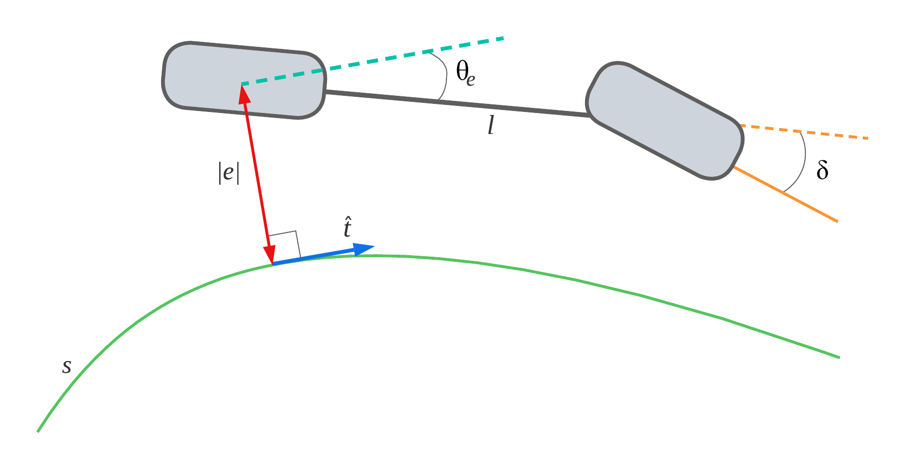

.. role:: python(code)
   :language: python

.. _fuzzy: 

Sistemas Difusos
================

«El agua sigue muy fría, está helada, súbele mucho más al calentón»
«El servicio y la comida de este restaurante fueron muy buenos, debemos dejar una
buena propina», «Vas lento, acelera un poco». 

Por ejemplo, ¿qué porcentaje de la cuenta podría considerarse una propina *muy
buena*? Un 5\% claramente no lo es; un 10\% suele considerarse “normal” (sin
considerar ciudades como Nueva York en la actualidad o países como Japón),
mientras que en algunas ciudades un 15\% o incluso un 18\% podrían ya
considerarse *muy buenos*.

Estas son algunas de las frases que podemos escuchar y entender perfectamente
en algún contexto dado. La pregunta es: ¿podemos representar esto
numéricamente?. 

Por ejemplo, ¿qué porcentaje de la cuenta podría considerarse una propina *muy
buena*? Un 5\% claramente no lo es; un 10\% suele considerarse “normal” (sin
considerar ciudades como Nueva York en la actualidad o países como Japón),
mientras que en algunas ciudades un 15\% o incluso un 18\% podrían ya
considerarse *muy buenos*.

No existe un límite exacto y universal: la interpretación depende del contexto,
la cultura y la experiencia previa. De manera similar, términos como frío, muy
frío, lento o rápido no tienen fronteras numéricas bien definidas. Cuando
utilizamos el lenguaje natural, los números precisos y los operadores lógicos
convencionales (como mayor que, menor que o igual a) resultan insuficientes
para capturar este tipo de conocimiento impreciso.

Ante esta limitación, Lotfi A. Zadeh propuso, en la década de los sesenta, una
extensión de la lógica clásica conocida como lógica difusa (*fuzzy logic*).
En lugar de exigir pertenencia absoluta a un conjunto (verdadero o falso),
la lógica difusa introduce el concepto de funciones de pertenencia,
variables difusas y términos lingüísticos, permitiendo modelar grados de
pertenencia intermedios.

Por ejemplo, retomando el caso de una propina *muy buena*, a continuación se
muestra una posible asignación del grado de pertenencia (un valor entre cero y
uno) para los porcentajes mencionados anteriormente:

Grado de pertenencia a *muy buena*:

- 5\%  → 0.0  
- 10\% → 0.4  
- 15\% → 0.8  
- 18\% → 1.0  

Gracias a este enfoque, es posible representar computacionalmente conceptos
vagos o subjetivos, como *temperatura alta*, *velocidad moderada* o *servicio
excelente*, de una forma más cercana al razonamiento humano. Los sistemas
difusos han sido ampliamente utilizados en áreas como el control automático,
la inteligencia artificial, los sistemas expertos y la toma de decisiones,
especialmente cuando los modelos matemáticos precisos son difíciles de obtener
o simplemente no existen.

En las siguientes secciones estudiaremos los fundamentos de los sistemas
difusos y su implementación utilizando Python, comenzando con las funciones de
pertenencia y avanzando gradualmente hacia sistemas de inferencia difusa
completos.

Funciones de Membresía
**********************

Las funciones de membresía son un elemento fundamental de la lógica difusa.
Continuando con el ejemplo de la propina, hasta el momento hemos asignado
únicamente algunos valores discretos de porcentaje a su grado de pertenencia
correspondiente.

Una función de membresía define un mapeo entre el dominio de valores que puede
tomar una variable difusa y el rango de sus grados de pertenencia. En nuestro
caso, el término lingüístico es *muy buena*, y su dominio puede definirse, por
ejemplo, en el intervalo de 0\% a 40\%. Aunque matemáticamente sería posible no
establecer un límite superior, en la práctica es importante definir un dominio
adecuado de acuerdo con el problema que se desea modelar.

La función de membresía mapea entonces el dominio de los porcentajes de propina
al intervalo de grados de pertenencia comprendido entre 0 y 1.

Veamos la definición formal de conjunto difuso propuesta por zadeh :cite:`zadeh1965fuzzy`:

Conjunto Difuso
---------------

Un **conjunto difuso** se define como un par :math:`(U, m)` 
donde:

- :math:`U` es un conjunto (usualmente no vacío), llamado **universo de
  discurso**, (en nuestro ejemplo es el conjuntp de porcentajes de propine que
  podemos dar).

- :math:`m` es una función de membresía :math:`m : U \rightarrow [0,1]` que asigna a cada elemento 
  :math:`x \in U`,un grado de membresía.

Así decimos que la función :math:`m = \mu_A` se denomina **función de membresía** del conjunto
difuso :math:`A = (U, m)`.

Dado un elemento :math:`x \in U`, se dice que:

- :math:`x` **no pertenece** al conjunto difuso si :math:`m(x) = 0`,
- :math:`x` **pertenece completamente** al conjunto difuso si :math:`m(x) = 1`,
- :math:`x` **pertenece parcialmente** al conjunto difuso si :math:`0 < m(x) < 1`.

Resulta útil visualizar este concepto de manera gráfica así que entraremos en 
materia utilizando la librería de `scikit fuzzy` para definir el término 
difuso *propina muy buena*. 

Visualización de funciones de membresía con scikit-fuzzy
--------------------------------------------------------

Una ventaja práctica de utilizar la librería ``scikit-fuzzy`` es que permite definir
funciones de membresía con formas estándar (triangulares, trapezoidales, gaussianas,
etc.) y visualizarlas de manera directa. Esto es útil para validar rápidamente si
la interpretación de un término lingüístico (por ejemplo, *muy buena*) coincide con
lo que esperamos en el problema.

En el ejemplo siguiente modelamos el término *propina muy buena* sobre el dominio
de 0\% a 100\% utilizando una función trapezoidal.

.. code-block:: python

   import numpy as np
   import skfuzzy as fuzz
   import matplotlib.pyplot as plt

   # Dominio (universo) de la variable: porcentaje de propina
   x_propina = np.linspace(0, 40, 501)

   # Función de membresía trapezoidal para el término lingüístico "muy buena"
   # [a, b, c, d] define el inicio, subida, meseta y bajada (en porcentaje).
   mx_muy_buena = fuzz.trapmf(x_propina, [10, 15, 20, 30])

   # Gráfica
   plt.figure(figsize=(8, 5))  # <- tamaño físico de la figura
   plt.plot(x_propina, mx_muy_buena, linewidth=2)
   plt.title("Función de membresía: propina 'muy buena'", fontsize=14)
   plt.xlabel("Propina (%)", fontsize=12)
   plt.ylabel("Grado de membresía μ", fontsize=12)

   plt.xticks(fontsize=10)
   plt.yticks(fontsize=10)
   
   plt.ylim(-0.05, 1.05)
   plt.grid(True)
   plt.tight_layout()
   plt.show()

.. note::

   Los parámetros ``[10, 15, 20, 30]`` son una elección de modelado. En
   problemas reales estos valores se ajustan con conocimiento experto, datos
   históricos o técnicas de optimización (esto se conecta con la siguiente
   capítulo de cómputo evolutivo).

El código anterior nos genera la siguiente gráfica:

.. figure:: ./images/fm.png
   :align: center
   :alt: Función de membresía (pertenencia) en scikit fuzzy.

   Función de membresía para el término lingüístico *Muy buena* (propina).

La función define un incremento en el grado de membresía a partir del 10\%,
hasta alcanzar el valor máximo de 1.0 en el intervalo comprendido entre 15\%
y 20\%. A partir de ese punto, el grado de membresía comienza a decrecer.

La razón de esta disminución es que también consideraremos el término
lingüístico *Excelente* (propina). En este esquema, porcentajes mayores al
20\% y más cercanos a 40\% tendrían un grado de pertenencia más alto al
término *Excelente* que al término *Muy buena*.

Variables lingüísticas
----------------------

En el contexto de nuestro ejemplo, la **propina** puede considerarse una
**variable lingüística** definida sobre el universo de discurso de los
porcentajes de propina. Esta variable puede tomar **valores lingüísticos** como
*poca*, *normal*, *buena*, *muy buena* y *excelente*, los cuales representan
conceptos cualitativos que usamos en el lenguaje natural.  

Matemáticamente modelamos cada uno de los **valores lingüísticos** usando
el **término difuso** correspondiente, es decir, un conjunto difuso definido sobre el universo
de discurso y caracterizado por su función de membresía.

Por ejemplo, el valor lingüístico *muy buena* se representa mediante el término
difuso asociado a la función de membresía
:math:`\mu_{\text{muy\_buena}}(x)`, que asigna a cada porcentaje de propina un
grado de pertenencia entre 0 y 1.

Reglas de inferencia difusas
---------------------------- 

Una de las manera de representar el conocimiento computacionalmente es mediante reglas IF-THEN, 
las cuales especifican que acciones se realizarán cuando ciertas condiciones se cumplan. 
Las reglas IF-THEN (también llamadas reglas de producción) tienen una dos partes; 
el antecedente, conformado por un conjunto de condiciones y el consecuente constituido por un
conjunto de conclusiones:

   .. code::
   # SI (condición) ENTONCES (conclusión).

Utilizando lógica difusa podemos definir reglas de inferencia que busquen
capturar la forma en que un humano razona en situaciones donde los límites
no son completamente nítidos. Por ejemplo, al decidir una propina, 
usamos razonamientos como:

- “Si el servicio fue *excelente*, entonces la propina debe ser *excelente*”.
- “Si el servicio fue *bueno* y la comida fue *buena*, entonces la propina es
  *muy buena*”.
- “Si el servicio fue *malo*, entonces la propina es *poca*”.

En un sistema difuso, las condiciones (proposiciones difusas) se construyen combinando términos
lingüísticos con conectores lógicos como **AND** y **OR**. Por ejemplo:

- SI servicio es *bueno* AND comida es *buena* ENTONCES propina es *muy buena*.
- SI servicio es *malo* OR comida es *mala* ENTONCES propina es *poca*.

Estas reglas no producen una decisión *binaria*. En su lugar, cada regla puede
tener cierto **grado** de activación, dependiendo de qué tan bien se cumplan sus
condiciones.

Sistemas de Inferencia Difusos
******************************

Los sistemas de inferencia difusos (FISs) se basan en las reglas de inferencia
difusas que vimos anteriormente. Los FIS definen relaciones entre variables de
entrada y de salida. Las variables de entrada se incluyen en los antecedentes
de la reglas y las variables de salida en los consecuentes. Dependiendo del
tipo de consecuente, se pueden distinguir dos tipos de sistemas de inferencia
difusos:

- Modelo difuso lingüístico: donde ambos el antecedente y consecuentes son proposiciones difusas.
- Modelo difuso Takagi-Sugeno* el antecedente es una preposición difusa; el consecuente es una función nítida (crisp).

Los sistemas de inferencia difusos típicamente tienen estos cuatro comonentes:

- Base de Reglas. El conjunto de reglas difusas.
- Máquina de Inferencia Difusa. Este modulo ejecuta las operaciones de inferencia difusa.
- Fusificador. Este modulo transforma las entradas del sistema (valores numéricos) en valores lingüísticos.
- Defusificador. Transforma los resultados difusas a valores numéricos.

Tipos de sistemas de inferencia difusa
--------------------------------------

A continuación se describen los tres tipos más utilizados de FIS.
La diferencia entre ellos es principalmente la forma en
que producen la salida.

**Tsukamoto**
   En el método de inferenca Tsukamoto, la salida de cada regla es un valor nítido
   obtenido a partir del grado de activación de la regla. La salida global del
   sistema se calcula como un promedio ponderado de las salidas individuales
   de las reglas.

**Mamdani**
   En el método de Mamdani, cada regla produce una **salida difusa**.

   Para obtener una salida nítida a partir del conjunto difuso resultante, se
   utilizan distintos métodos de **defuzzificación**, entre los más comunes se
   encuentran:
   - el método del **centroide**,
   - la **bisección del área**,
   - el **promedio de los máximos**,
   - el **criterio del máximo**.

   Este es uno de los métodos más utilizados debido a su interpretación
   intuitiva y a su cercanía con el razonamiento humano.

**Sugeno**
   En el método de Sugeno, el consecuente de cada regla no es un conjunto
   difuso, sino una **función matemática** de las variables de entrada, típicamente
   una combinación lineal de estas más un término constante.
   Este enfoque es especialmente adecuado para sistemas
   de control y optimización, ya que facilita el análisis matemático y la
   implementación computacional.

En este capítulo no entraremos en detalle sobre como se hace implementan
internamente este tipo de sistemas. Lo que nos interesa es la implementación en
Python. Implementemos un FIS que tome de entrada las variables difusas *comida*
y *servicio* y nos de como salida la *propina* que vamos a dejar.

Implementación de un sistema de inferencia difusa en Python
-----------------------------------------------------------

El primer paso es definir las variables lingüisticas y asignarlas a su posición ya sea en  
el *antedecente* o el *consecuente*. Lo importante para definir estas variables el dominio 
o universo de discurso. En el caso de las variables de entrada que miden la calidad de la comida 
y el servicio, estas irán de cero a diez. Como ya lo decidimos la propina va de 0 a 40 porciento.

.. code-block:: python

   import numpy as np
   import skfuzzy as fuzz
   from skfuzzy import control as ctrl
   import matplotlib.pyplot as plt

   # Variables de entrada (antecedentes)
   comida = ctrl.Antecedent(np.arange(0, 11, 1), 'comida')     # 0..10
   servicio = ctrl.Antecedent(np.arange(0, 11, 1), 'servicio') # 0..10

   # Variable de salida (consecuente)
   propina = ctrl.Consequent(np.arange(0, 41, 1), 'propina')   # 0..40 (%)

Una vez definidas las variables agregamos las funciones de membresía de para los términos difusos de cada una.
Utilizamos funciones triangulares y trapezoidales:

.. code-block:: python

   # Funciones de membresía: comida
   comida['mala'] = fuzz.trapmf(comida.universe, [0, 0, 2, 4])
   comida['regular'] = fuzz.trimf(comida.universe, [3, 5, 7])
   comida['buena'] = fuzz.trapmf(comida.universe, [6, 8, 10, 10])

   # Funciones de membresía: servicio
   servicio['malo'] = fuzz.trapmf(servicio.universe, [0, 0, 2, 4])
   servicio['regular'] = fuzz.trimf(servicio.universe, [3, 5, 7])
   servicio['excelente'] = fuzz.trapmf(servicio.universe, [6, 8, 10, 10])

   # Funciones de membresía: propina
   propina['poca'] = fuzz.trapmf(propina.universe, [0, 0, 5, 10])
   propina['normal'] = fuzz.trimf(propina.universe, [8, 12, 16])
   propina['muy_buena'] = fuzz.trapmf(propina.universe, [14, 18, 22, 26])
   propina['excelente'] = fuzz.trapmf(propina.universe, [22, 28, 40, 40])

Podemos ver las variables gráficamente utilizando el metodo ``view()``:

.. code-block:: python

   # (Opcional) Visualizar funciones
   comida.view(); servicio.view(); propina.view()
   plt.show()

Ejemplo:

.. figure:: ./images/propina.png
   :align: center
   :alt: Variable lingüística ``propina`` en scikit fuzzy.

   Gráfica de las funciones de membresía para la variable lingüística *propina*.

Base de reglas difusas
----------------------

Creamos las reglas utilizando los operadores lógicos, antecedente y consecuente 
según la variable lingüística y función de membresía:

.. code-block:: python

   regla1 = ctrl.Rule(servicio['malo'] | comida['mala'], propina['poca'])
   regla2 = ctrl.Rule(servicio['regular'] & comida['regular'], propina['normal'])
   regla3 = ctrl.Rule(servicio['excelente'] & comida['buena'], propina['excelente'])

   # Reglas intermedias para dar suavidad al sistema
   regla4 = ctrl.Rule(servicio['regular'] & comida['buena'], propina['muy_buena'])
   regla5 = ctrl.Rule(servicio['excelente'] & comida['regular'], propina['muy_buena'])

Construcción y simulación del sistema
-------------------------------------

Vamos a construir un FIS tipo Mamdani y probaremos el caso de una *comida* de 7.0 
con un buen servicio 9.0. Recordemos que en el caso de Mamdani las entradas y salidas
son datos nítidos.

.. code-block:: python

   sistema = ctrl.ControlSystem([regla1, regla2, regla3, regla4, regla5])
   simulacion = ctrl.ControlSystemSimulation(sistema)

   # Entradas nítidas (crisp) del usuario
   simulacion.input['comida'] = 7.0
   simulacion.input['servicio'] = 9.0

   # Ejecutar inferencia
   simulacion.compute()

   # Salida nítida
   print("Propina sugerida (%):", simulacion.output['propina'])

   # Visualizar el resultado sobre la membresía de salida
   propina.view(sim=simulacion)
   plt.tight_layout()
   plt.show()

Podemos ver gráficamente el resultado de la inferencia con una defuzzificación por centroide:

.. figure:: ./images/salida.png
   :align: center
   :alt: Salida de nuestro FIS para ``propina`` en scikit fuzzy.

   Gráfica de las funciones de membresía para la variable lingüística *propina*.

Control Difuso
**************

No te preocupes si esta no es tu área de especialidad. El enfoque que veremos
en este libro será principalmente **computacional**, con el objetivo de mostrar
cómo la lógica difusa puede aplicarse al diseño de sistemas de control sin
necesidad de un trasfondo profundo en teoría clásica de control.

Si estás estudiando ingeniería en electrónica, cibernética o algún área afín,
es muy probable que hayas llevado algún curso de *Teoría de Control* o algo
similar. En particular, en cibernética esta área es fundamental: incluso el
nombre proviene del término griego que hace referencia a gobernar el timón de
una embarcación. En este caso podrás profundizar análizando el código que 
utilizaremos para simulación.

¿Teoría de Control?
-------------------

La teoría de control tiene innumerables aplicaciones en la vida cotidiana, y
disfrutamos de sus beneficios de manera constante. Por ejemplo, en un sistema
de aire acondicionado, un controlador regula el encendido y la potencia para
mantener una temperatura deseada. El *cruise control* de un automóvil es otro
ejemplo, así como el piloto automático de un avión o un dron.

Incluso dispositivos tan comunes como una lavadora o una cafetera de espresso
utilizan sistemas de control para regular variables como el flujo y la
temperatura del agua. En todos estos casos, el objetivo es el mismo: ajustar el
comportamiento del sistema para que siga una referencia deseada.

La teoría moderna de control se consolidó a finales de la década de 1960 con el
desarrollo del control basado en modelos (*model-based control*, MBC) y del
control óptimo. En este enfoque, el comportamiento de un sistema dinámico se
describe mediante ecuaciones diferenciales o ecuaciones discretas en tiempo
(*ecuaciones en diferencias*), generalmente no lineales, y el diseño del
controlador se basa explícitamente en dicho modelo matemático.

Para aplicar control basado en modelos, el diseñador debe primero obtener un
modelo suficientemente preciso del sistema que se desea controlar (conocido en
teoría de control como la *planta*) y, posteriormente, diseñar un controlador
que garantice estabilidad y desempeño. Si bien este enfoque ha sido
extraordinariamente exitoso, en muchos sistemas reales la obtención de modelos
precisos resulta difícil, costosa o incluso inviable.

.. sidebar:: Simulación de sistemas dinámicos en Python (opcional)

   En muchas aplicaciones de control, el comportamiento de un sistema físico se
   describe mediante ecuaciones diferenciales que modelan cómo cambian las
   variables de estado en el tiempo. En Python, una forma común de simular este
   tipo de sistemas es utilizando integradores numéricos como
   :func:`scipy.integrate.odeint`.

   En este libro no modelaremos explícitamente los sistemas que controlamos; la
   simulación se tratará como una caja negra. Sin embargo, es importante tener
   presente que, internamente, estas simulaciones resuelven ecuaciones
   diferenciales de manera numérica para obtener la evolución temporal del
   sistema.

   Puedes ver la librería en acción ya que en anexos se incluye el código de 
   la simulación.

Como alternativa a estos métodos, a principios de la década de 1970 surgió el
control inteligente (*intelligent control*), el cual propone generar acciones
de control a partir de conocimiento humano, experiencia operativa y evidencia
experimental, en lugar de depender exclusivamente de un modelo matemático del
sistema. 

Entre las técnicas de control inteligente, el control difuso (*fuzzy logic
control*) ha sido una de las más exitosas y ampliamente adoptadas. Desde los
trabajos pioneros de Mamdani, hasta aplicaciones modernas en control industrial,
robótica y sistemas complejos, el control difuso ha demostrado ser una
herramienta robusta y flexible para enfrentar incertidumbre, no linealidades y
conocimiento incompleto.

De manera paralela, en años recientes ha cobrado gran relevancia el control
basado en datos (*data-driven control*), un conjunto amplio de técnicas en las
que el modelo del sistema o el diseño del controlador se obtiene directamente a
partir de datos. Este enfoque incluye métodos como aprendizaje por refuerzo,
control por aprendizaje iterativo, herramientas de control robusto basadas en
datos, así como técnicas apoyadas en redes neuronales y algoritmos evolutivos.

Una ventaja fundamental del control difuso frente a otros métodos de control
inteligente es que se implementa mediante un **sistema de inferencia difusa**
(*fuzzy inference system*, FIS), el cual representa explícitamente el
conocimiento del sistema a través de reglas difusas. Estas reglas tienen una
interpretación lingüística clara, lo que facilita su diseño, análisis y ajuste,
ya sea de forma manual o automática.

En este capítulo introduciremos los fundamentos del control difuso desde una
perspectiva práctica, comenzando con la estructura de un sistema de inferencia
difusa y culminando con la implementación de controladores difusos en Python.
En capítulos posteriores se abordará el ajuste sistemático de estos
controladores mediante técnicas de optimización.

Control difuso de un sistema de seguimiento de ruta con rueda trasera
---------------------------------------------------------------------

Como ejercicio principal de este capítulo, diseñaremos un sistema difuso para
controlar el volante de un robot tipo bicicleta que debe seguir una ruta
previamente establecida. Este es un **sistema dinámico**, ya que en cada instante
de tiempo se toman lecturas de la posición del robot y, con base en ellas, se
ajusta el volante mediante una velocidad angular.

El esquema general de los elementos que intervienen en el sistema se muestra a
continuación:

   Modelo de rueda trasera para control de seguimiento.

En esta simulación el mundo es bidimensional y la escala está expresada en
metros. La unidad de tiempo es el segundo, y la simulación se ejecuta durante
50 segundos.

Definición de la ruta
~~~~~~~~~~~~~~~~~~~~~

La ruta a seguir se define mediante una curva suave generada a partir de un
*spline*. Este tipo de representación es similar a las curvas Bézier utilizadas
en programas de ilustración. Para definir la ruta se especifica un conjunto de
puntos :math:`(x, y)` en el plano 2D y una función *spline* que, dado un parámetro
(real o entero), devuelve la posición correspondiente sobre la trayectoria.

Denotaremos la posición de la ruta como :math:`\mathbf{S}(t)`.

Modelo del robot
~~~~~~~~~~~~~~~~~

El robot consiste en dos ruedas conectadas por un eje de longitud :math:`L` y se
desplaza únicamente en el plano 2D. El modelo es puramente cinemático: no se
consideran efectos de fricción, derrape ni dinámicas verticales. La velocidad
lineal se regula automáticamente mediante un controlador interno tipo PID, y se
mantiene constante en :math:`3\,\text{m/s}`.

La posición del robot se toma a partir de la rueda trasera, la cual inicia en el
punto :math:`(0, 0)`.

Variables del controlador
~~~~~~~~~~~~~~~~~~~~~~~~~

Las variables que intervienen en el controlador difuso, evaluadas en un instante
de tiempo :math:`t_i`, son las siguientes:

``e``
   Distancia lateral de la rueda trasera al punto más cercano de la ruta. Este
   punto se calcula internamente en la simulación utilizando información del
   paso anterior :math:`t_{i-1}` y la dirección de avance. El error se mide en
   metros y se define como negativo cuando el robot se encuentra a la izquierda
   de la ruta y positivo cuando se encuentra a la derecha. El objetivo del
   controlador es que este error tienda a cero.

``e_\theta``
   Error de orientación, definido como el ángulo entre el vector tangente a la
   ruta en el punto más cercano y el eje longitudinal del robot.

``\omega``
   Salida del controlador difuso. Representa la velocidad angular utilizada para
   calcular el ángulo de dirección :math:`\delta` del modelo tipo bicicleta.

Condiciones iniciales y objetivo
~~~~~~~~~~~~~~~~~~~~~~~~~~~~~~~~

La ruta y el robot inician en el punto :math:`(0, 0)` con velocidad inicial cero.
El objetivo principal del control es minimizar el error de seguimiento, medido
mediante el error cuadrático medio (*root mean square error*, RMSE) de la
variable :math:`e`, y alcanzar la meta correspondiente al final de la ruta.

Plantilla del controlador difuso
~~~~~~~~~~~~~~~~~~~~~~~~~~~~~~~~

El archivo ``my_fis.py`` debe definir una función ``build_fis`` que regrese
el sistema difuso para ser utilizado en el controlador. 
Dicho controlador recibirá como entradas el error de
orientación ``e_th`` y el error lateral ``e``, y devuelve como salida la
velocidad angular ``omega``.

La simulación se encarga de llamar a este controlador en cada instante de tiempo.

.. code-block:: python
    :linenos:
    :caption: Archivo plantilla ``my_fis.py``

    import numpy as np
    import skfuzzy as fuzz
    from skfuzzy import control as ctrl

    def build_fis(params=None):
        """
        Construye el sistema de inferencia difusa (FIS).

        params: dict | None
           Parámetros opcionales para modificar las funciones de membresía.
           En esta versión base, se ignoran o se usan valores por defecto.
        """

        # Universos (sin normalizar todavía)
        e_th = ctrl.Antecedent(np.linspace(-1.5, 1.5, 201), 'e_th')  # rad aprox.
        e = ctrl.Antecedent(np.linspace(-3.0, 3.0, 201), 'e')  # m
        omega = ctrl.Consequent(np.linspace(-8.0, 8.0, 201), 'omega')  # rad/s

        # Parámetros por defecto (ajustables después)
        # Nota: estos valores son intencionalmente simples; se optimizarán más adelante.
        eth_z = params.get("eth_z", 0.15) if isinstance(params, dict) else 0.15
        e_z = params.get("e_z", 0.30) if isinstance(params, dict) else 0.30
        w_z = params.get("w_z", 0.80) if isinstance(params, dict) else 0.80

        # e_th: NS, Z, PS
        e_th['NS'] = fuzz.trapmf(e_th.universe, [-1.5, -1.5, -0.4, 0.0])
        e_th['Z'] = fuzz.trimf(e_th.universe, [-eth_z, 0.0, eth_z])
        e_th['PS'] = fuzz.trapmf(e_th.universe, [0.0, 0.4, 1.5, 1.5])

        # e: NS, Z, PS
        e['NS'] = fuzz.trapmf(e.universe, [-3.0, -3.0, -0.8, 0.0])
        e['Z'] = fuzz.trimf(e.universe, [-e_z, 0.0, e_z])
        e['PS'] = fuzz.trapmf(e.universe, [0.0, 0.8, 3.0, 3.0])

        # omega: NS, Z, PS
        omega['NS'] = fuzz.trapmf(omega.universe, [-8.0, -8.0, -2.5, 0.0])
        omega['Z'] = fuzz.trimf(omega.universe, [-w_z, 0.0, w_z])
        omega['PS'] = fuzz.trapmf(omega.universe, [0.0, 2.5, 8.0, 8.0])

        # Reglas explícitas (3x3)
        rules = [
            ctrl.Rule(e_th['NS'] & e['NS'], omega['PS']),
            ctrl.Rule(e_th['NS'] & e['Z'], omega['PS']),
            ctrl.Rule(e_th['NS'] & e['PS'], omega['Z']),

            ctrl.Rule(e_th['Z'] & e['NS'], omega['PS']),
            ctrl.Rule(e_th['Z'] & e['Z'], omega['Z']),
            ctrl.Rule(e_th['Z'] & e['PS'], omega['NS']),

            ctrl.Rule(e_th['PS'] & e['NS'], omega['Z']),
            ctrl.Rule(e_th['PS'] & e['Z'], omega['NS']),
            ctrl.Rule(e_th['PS'] & e['PS'], omega['NS']),
        ]

        fis = ctrl.ControlSystem(rules)
        return fis

Controlador de referencia
~~~~~~~~~~~~~~~~~~~~~~~~~~~~~~~~

Antes de introducir el controlador difuso, utilizaremos un controlador de
referencia basado en una ley de control clásica propuesta por Paden et al. Este
controlador se utiliza cuando no se proporciona un controlador externo a la
simulación.

Esta es su implementación:

.. code-block:: python
    :linenos:
    :caption: Implementación del controlador de referencia implementado en ``rear_wheel_sim.py``

    def paden_control(error, error_theta, v, k):
        """
        Controlador de referencia basado en Paden et al.
        """

        # Constantes del controlador (baseline)
        KTH = 1.0
        KE = 0.5

        omega = (
            v * k * math.cos(error_theta) / (1.0 - k * error)
            - KTH * abs(v) * error_theta
            - KE * v * math.sin(error_theta) / error_theta * error
        )

        return omega

El controlador de referencia:

- utiliza un modelo cinemático explícito del sistema,

- emplea la velocidad del robot ``v`` y parámetros geométricos de la ruta ``k``,
- sirve como punto de comparación (baseline).

No se espera que el controlador difuso supere a este controlador en esta etapa.
Su propósito es ofrecer una referencia funcional y estable.

La diferencia entre ambos enfoques:

- El controlador de referencia utiliza información explícita del modelo y de la geometría de la ruta.
- El controlador difuso no utiliza el modelo ni la velocidad del robot.
- El controlador difuso se basa únicamente en errores geométricos y reglas lingüísticas.

Generación de controlador difuso
~~~~~~~~~~~~~~~~~~~~~~~~~~~~~~~~

En el mismo archivo está definida una funcion que devuelve el controlador

.. code-block:: python
    :linenos:
    :caption: Archivo plantilla ``my_fis.py``

    def get_controller(params=None):
        """
       Devuelve un controlador callable: (e_th, e) -> omega.
       """

        fis = build_fis(params)
        sim = ctrl.ControlSystemSimulation(fis)

        def controller(e_th, e):
            # scikit-fuzzy acumula estado interno; para simulación en lazo cerrado
            # suele ser más robusto reiniciar en cada evaluación.
            sim.reset()
            sim.input['e_th'] = float(e_th)
            sim.input['e'] = float(e)
            sim.compute()
            return float(sim.output['omega'])

.. code-block:: python
    :linenos:
    :caption: Archivo plantilla ``my_fis.py``

    import my_fis as fc
    import rear_wheel_sim as rw_sim
    import path
    import numpy as np

    def compute_rmse(traces):
        errors = np.array([tr.error for tr in traces])
        return np.sqrt(np.mean(errors**2))

    if __name__ == "__main__":
        print("rear wheel feedback tracking start!!")

        paths = [
            ([0.0, 6.0, 12.5, 5.0, 7.5, 3.0, -1.0], [0.0, 0.0, 5.0, 6.5, 3.0, 5.0, -2.0]),
            ([0.0, 1.0, 2.5, 5.0, 7.5, 3.0, -1.0], [0.0, -4.0, 6.0, 6.5, 3.0, 5.0, -2.0]),
     #      ([0.0, 2.0, 2.5, 5.0, 7.5, -3.0, -1.0], [0.0, 3.0, 6.0, 6.5, 5.0, 5.0, -2.0]),
        ]

        #controller = None
        controller = fc.get_controller()
        rmses = []
        for ax, ay in paths:
            goal = [ax[-1], ay[-1]]
            reference_path = path.CubicSplinePath(ax, ay)

            result = rw_sim.simulacion(
                reference_path,
                goal,
                controller=controller,
            )

            traces = result["traces"]
            rmse = compute_rmse(traces)
            rmses.append(rmse)

        print(float(np.mean(rmses)))
        # Visualización (opcional): se ejecuta después de la simulación
        #rw_sim.animate(result, pause=0.001)
        #rw_sim.plot(result)

