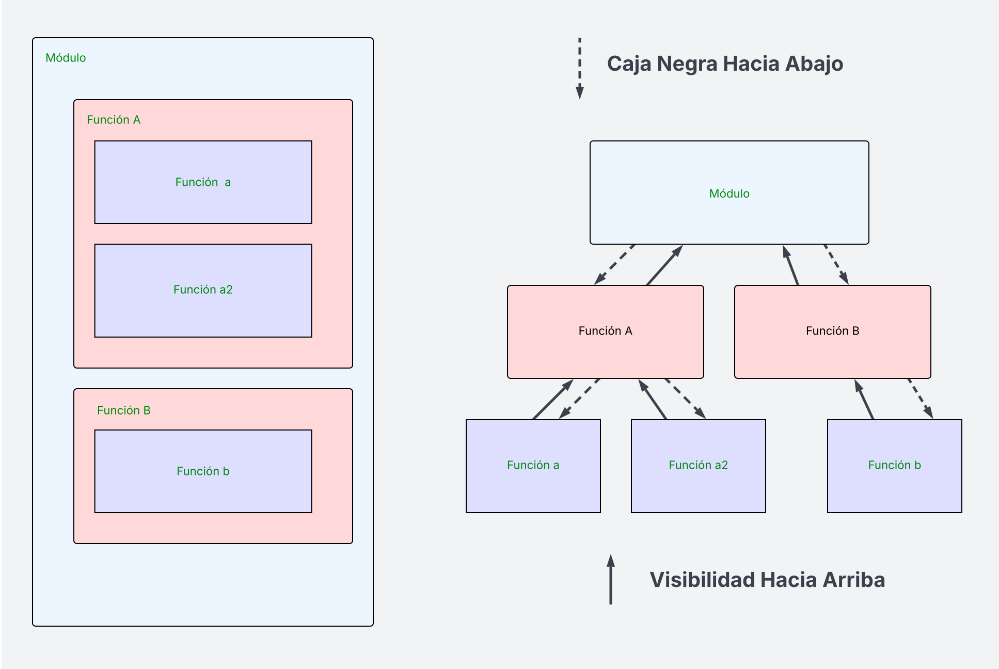
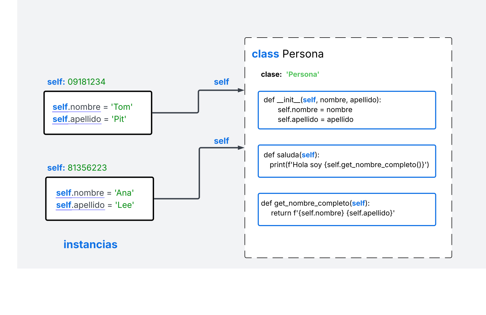

.. role:: python(code)
   :language: python

Programación Orientada a Objetos en Python
==========================================

Como ya hemos visto, Python *no* es un lenguaje orientado a objetos (OO) puro.
Podemos programar scripts en los cuales  no es necesario utilizar el paradigma
explicitamente.  Aunque los tipos de datos, estructuras e incluso las funciones
son objetos, no es necesario implementar una clase principal o métodos miembro
para poder escribir un programa. Incluso parecería que la implementación del
paradigma es un agregado de último momento. Un parche. Esta impresión radica (en
mi opinión) en la sintáxis para expresar algunos elementos,
como los constructores, el páso de una referencia (:python:`self`) en la
definición métodos miembro, entre otras.

Un aspecto crucial de la Programción Orientada a Objetos es el tipado estrícto.
Esto ocasiona que tengamos que utilizar mecanismos elaborados para hacer
cosas que en un lenguaje dinámico se hacen muy fácilmente. Por ejemplo,
el polimorfismo, plantillas o el uso de interfaces. Un programador
experimentado sabe que todas estas 'libertades' pueden traer problemas, pero al
mismo tiempo nos permiten el desarrollo de programas *sin tanto verbo* (del inglés verbose).

Por esta razón, creo que Python puede no ser el mejor lenguaje para aprender
Programación Orientada a Objetos (POO), ya que muchos de los temas o elementos de
programación no tienen una aplicación directa.  Por otro lado, el hecho de que
el paradigma sea *opcional* evita que se establezcan reglas de acción para
solucionar problemas de una manera más o menos estándar, ya que hay varias
formas de hacer todo. Entonces, creo que esta sección no debería ser
tan extensa como en los libros de otros lenguajes ya que los elementos de POO
en Python no son tan extensos. El enfoque estará en ver y enteder las
diferencias entre paradigmas en términos de programación.

.. note::
    A lo largo del libro veremos que si hay un estilo de programación en Python,
    pero al igual que el lenguaje es algo libre e híbrido.

Ámbitos y espacios de nombres en Python
***************************************
La documentación oficial de Python aborda este importante tema en la sección
de definición de  `clases <https://docs.python.org/es/3.13/tutorial/classes.html#python-scopes-and-namespaces>`_.
En este libro vamos a seguir la misma estructura ya que es una manera interesante
de abordar las diferencias entre los paradigmas procedural/funcional y el orientado a objetos.
Entender muy bien estos conceptos nos hará mejores programadores independientemente
del paradigma que utilicemos. Primero es importante definir que es un espacio de nombres y
después el ámbito de visibilidad que hay entre ellos.

Iniciemos una nueva sesión del interprete y como primera instrucción vamos a
ejecutar el método incluido de fábrica :python:`dir()`.
Cuando invocamos esta función sin argumentos, nos regresa una lista
de cadenas que representan los nombres definidos en el ámbito actual:

   >>> dir()
   ['__annotations__', '__builtins__', '__cached__', '__doc__', '__file__', '__loader__', '__name__', '__package__', '__spec__']

Estos son los **nombres** disponibles **en ese punto del programa**. Entre estos nombres
encontramos: variables internas, módulos cargados automáticamente y
otros elementos del contexto de ejecución. Es comprender esta idea fundamental:

.. note::

   En todo momento, nuestro programa opera dentro de un **ámbito limitado** de nombres.

   La función dir() nos permite asomarnos a ese ámbito y conocer qué
   identificadores están definidos y disponibles en este momento.

Vamos a crear algunos nombres adicionales en este ámbito.

   >>> entero = 1234
   >>> nombre = 'Ana'

Como es de esperarse estos nombres se agregan al ámbito actual:
   >>> dir()
   ['__annotations__', '__builtins__', 'entero',  'nombre']
   # El resultado se recortó para que no ocupe tanto espacio.

Incluso podemos agregar una función:

   >>> def genera_correo(n):
   ...     dominio = 'gmail.com'
   ...     print(dir())
   ...     return f'{n}@{dominio}'
   ...
   >>> dir()
   ['__annotations__', '__builtins__', '__cached__', '__doc__', '__file__', '__loader__', '__name__', '__package__', '__spec__', 'entero', 'genera_correo', 'nombre']

Esta función incluye la variable local :python:`dominio` y el argumento :python:`n`. Es importante notar que estos dos nombres,
**no están disponibles en el ámbito actual**.

Como demostración en la función :python:`genera_correo(n)` se imprime el resultado de :python:`dir()`:

   >>> genera_correo('juan')
   ['dominio', 'n']
   'juan@gmail.com

Ahora, como es de esperarse, solo se imprimen los nombres :python:`['dominio',
'n']`.  Estos dos nombres están ocultos, no se pueden modificar ni leer desde
fuera. Solo las instrucciones dentro del ámbito pueden hacerlo.  Este es un
principio importante de la programación estructurada y la programación orientada
a objetos:

Ocultación de la información (information hiding)
^^^^^^^^^^^^^^^^^^^^^^^^^^^^^^^^^^^^^^^^^^^^^^^^^

   Es un principio por el cual se separan los detalles de implementación de los
   detalles de uso, de modo que los componentes de un programa solo acceden a lo
   que necesitan saber, y no a los mecanismos internos de otros componentes

En este ejemplo, si necesitamos crear un correo electrónico, solo podemos ver
el nombre de la función y su parámetro. Pero no tenemos control sobre lo que sucede
dentro, los detalles de implementación. Esto puede permitir a los programadores
mejorar la implementación interna sin afectar al resto del programa. Por ejemplo,
vamos a mejorar un poco la implementación:

   >>> def genera_correo(n, dominio='gmail.com'):
   ...    return f'{n}@{dominio}'
   ...

Ahora podemos enviar como segundo parámetro el dominio del correo y por defecto
se pasa :python:`'gmail.com'` de esta manera, algunas
partes del programa seguiran llamando a la función de la manera anterior sin
que les afecte el nuevo cambio. Y en otras partes se puede utilizar de la nueva manera.

   >>> genera_correo('juan')
   'juan@gmail.com'
   >>> genera_correo('juan','hotmail.com')
   'juan@hotmail.com'

Al ocultar los detalles de implementación evitamos que los usuarios de nuestras funciones
dependan de las decisiones que tomemos internamente y que no les afecten los cambios.

En el caso de variables locales como las de la función anterior. Se crean al momento de
llamar a la función y se eliminan cuando la función regresa o se lanza alguna excepción.
También hay ambitos de nombres que tienen una vida más duradera, por ejemplo, los
nombres de fabrica (``builtins``), se crean al iniciar el intérprete y nunca se destruyen.

Visibilidad y Encapsulamiento en un Módulo
^^^^^^^^^^^^^^^^^^^^^^^^^^^^^^^^^^^^^^^^^^

Este concepto de ocultar o encapsular la información es importante en la programación
estructurada al momento de descomponer la funcionalidad de nuestros programas. Podemos seguir un
diseño descendente (top-down) dividiendo el problema que atacamos en diversos subproblemas y estos
a su vez en otros más pequeños. En Python podemos organizar nuestro código en módulos (ver sección de modulos)
en los cuales pueden contener funciones las cuales a su vez pueden definir funciones internas.
El punto clave es que las funciones internas **no son accesibles** desde fuera de su función contenedora.
Sin embargo, las funciones anidadas tienen acceso al contexto de las funciones que las contienen.
Esta estructura se muestra en la siguiente figura:

En el lado izquierdo podemos observar la estructura jerárquica dentro de un módulo (azul claro)
en Python esto puede ser un archivo ``.py``. Dentro del módulo hay funciones principales:
en este caso la Función A y Función B (rosadas). A su vez cada función principal puede contener internamente otras
funciones (lavanda):

- La ``Función A`` contiene las funciones ``a`` y ``a2``
- La ``Función B`` contiene a la ``función b``

Este es un modelo anidado de funciones, donde las funciones internas solo son visibles
desde las funciones que las contienen. Del lado derecho se ve en detalle este concepto de
visibilidad:

El flujo está hacia abajo lo vemos como una "caja negra": los niveles superiores
no conocen los detalles internos de los niveles inferiores (encapsulamiento).
Ahora, las flechas discontínuas nos muestran la visibilidad permitida: las
funciones internas (a, a2, b) pueden "ver" o acceder a los nombres locales de
las funciones que las contienen (A, B), y estas a su vez a los nombres de los
módulos.

Veamos un ejemplo. Al iniciar en intérprete estamos al nível de un módulo.
Vamos a definir un nombre a este nivel:

>>> x = 123

Ya ahora una función a este nivel, la cual internamente tiene dos funciones:

>>> def Función_A():
...     A = 333
...     def función_a():
...         print(x)
...         print(A)
...     def función_a2():
...         x = 1
...     función_a()
...     función_a2()

La función incluye un nombre ``A`` local y fíjate que dentre de la ``función_a``
se leen los nombres ``x`` y ``A`` de los ámbitos externor. Esta es la
visibilidad hacia arriba. Ahora también en la ``función_b`` intentamos modificar
a la variable externa ``x``, esto realmente crea una variable local ``x`` y no
se modifica la externa.

Una vez definidas las funciones, podemos ver que no es posible
llamar a la función interna ``función_a()``:

>>> función_a()
Traceback (most recent call last):
  File "<python-input-4>", line 1, in <module>
    función_a()
    ^^^^^^^^^
NameError: name 'función_a' is not defined. Did you mean: 'Función_A'?

Lo podemos hacer llamando a la función que esta directamente en este ámbito,
la ``Función_A()`` internamente llama a sus funciones y solo vemos el resultado:

>>> Función_A()
123
333

Como vemos la función ``x`` no fue modificada.

>>> x
123

Para modificar o crear un objeto en el ámbito del módulo
podemos hacerlo utilizando la palabra clave ``global``:

.. code-block:: python

   >>> def Función_A():
   ...     A = 333
   ...     def función_a():
   ...         print(x)
   ...         print(A)
   ...     def función_a2():
   ...         global x
   ...         x = 1
   ...     función_a()
   ...     función_a2()

   >>> Función_A()
   123
   333

   >>> x
   123

ar un nombre que esta definido en un ámbito externo
(más arriba en la jerarquía), podemos utilizar la palabra reservada ``nonlocal``
de manera similar a ``global``.

En resúmen, son importantes estos tres conceptos:

- **Encapsulamiento**: Las funciones internas no son accesibles desde fuera de su función contenedora.
- **Alcance léxico**: Las funciones anidadas tienen acceso al contexto de las funciones que las contienen.
- **Diseño modular**: El módulo oculta los detalles internos a quien lo usa; solo expone una interfaz (las funciones principales).

Estos conceptos se utilizan de nuevo en la programación orientada a objetos.

Clases
******

Tomando como base el concepto de encapsulamiento, para hacer un cambio de paradigma.
En un módulo podemos tener un ambito que incluye datos (nombres) y funciones para
encapsular cierta funcionalidad. En orientación a objetos, un clase encapsula los
atributos (en lugar de datos) y métodos (en lugar de funciones) que definen
a un nuevo tipo de objeto. Cada objeto lo podríamos ver como un módulo independiente,
con sus propios datos y funcionalidad interna. Aunque conceptualmente el
encapsulamiento lo hemos visto como ocultar información y funciones, en realidad
esto se hace de manera selectiva, cuándo definimos un módulo podemos especificar
que datos y funciones serán visibles a otros módulos. Lo mismo sucede en la programación
orientada a objetos. Veamos un ejemplo:

>>> class Persona:
...     clase = 'Persona'
...     def __init__(self, nombre, apellido):
...         self.nombre = nombre
...         self.apellido = apellido
...     def get_nombre_completo(self):
...         return f'{self.nombre} {self.apellido}'
...     def saluda(self):
...         print(f'Hola soy {self.get_nombre_completo()}')
...

Vemos como la definición es básicamente un bloque dónde definimos métodos y
atributos. Como cada instancia (objeto) de esta clase tendrá sus propios atributos y
todas las instancias van a compartir los métodos definidos en su clase.
Debemos utilizar la referencia ``self`` para identificar al objeto particular
que estamos utilizando.

.. code-block:: python

   >>> ana = Persona('Ana', 'Lee')
   >>> ana.saluda()
   Hola soy Ana Lee
   >>> tom = Persona('Tom', 'Pit')
   >>> tom.saluda()
   Hola soy Tom Pit
   >>> Persona.clase
   'Persona'

En este código creamos dos instancias de la clase Persona, cada objeto se
crea en una localidad independiente de memoria y la podemos referenciar
utilizando :python:`self`. Esto lo debemos de especificar explicitamente al
definir la clase para decir que estos son atributos y métodos de instancias.
En el caso del atributo :python:`Persona.clase` este no tiene :python:`self` porque se
trata de un atributo de la clase. Cuando ejecutamos el método de instancia
:python:`saluda`, por ejemplo :python:`ana.saluda()` no es necesario enviar
la referencia :python:`self`, esto se hace implicitamente.

.. note::

   Es importante agregar la referencia :python:`self` en todos lados. Por
   ejemplo, :python:`self.get_nombre_completo()`, aunque esto no es necesario en otros
   lenguajes, uno de los principios básicos de Python es "Explicito es
   preferible a implícito".

Métodos Especiales
^^^^^^^^^^^^^^^^^^

El método :python:`__init__` es un "método especial", a estos métodos comúnmente
les llamamos "métodos mágicos" ya que están encerrados entre doble guiones bajos
:python:`__mágico__()`. Si vienes de un lenguaje orientado a objetos puro como
C# o Java, sabes que todos los objetos heredan cierta funcionalidad común desde
una clase base universal como ``Object``.  Como todos los objetos hereda de
``Object``, todos los objetos incluyen métodos como ``ToString()`` o
``Equals()`` entre otros. Estos métodos se ejecutan de manera automática cuando
realizamos ciertas operaciones sobre los objetos, por ejemplo, cuándo imprimimos
un objeto automáticamente se ejecuta ``ToString()`` y se imprime el texto que
regresa. Normalmente redefinimos estos métodos utilizando algo como
``override``, para cambiar el comportamiento incluido "por defecto".

.. note:: Explicito es mejor que implícito

 En Python estos métodos se nombran de una manera especial (entre doble guión
 ``__``) para indicar **explícitamente** que éstos métodos no se deben invocar
 directamente, el intérprete lo hará cuando se requiera.

Los métodos especiales se invocan al realizar operaciones como:
:python:`print(objeto)` esto llamaría a :python:`objeto.__str__()` en caso de
que no se haya redefinido intenta llamar al método :python:`objeto.__repr__`. El
método :python:`__str__` debería mostrar información "legible para humanos" y
por otro lado :python:`__repr__` es una representación para programadores con la
itención de que sirva para depurar el código. Vamos a modificar la clase anterior para
que podamos imprimir los objetos diractamente:

.. code-block:: python

   class Persona:
      clase = 'Persona'
      def __init__(self, nombre, apellido):
         self.nombre = nombre
         self.apellido = apellido
      def __str__(self):
         return f'{self.nombre} {self.apellido}'
      def saluda(self):
         print(f'Hola soy {self}')

Como ya redefinimos el método mágico :python:`__str__()`, podemos hacer los siguente:

.. code-block:: python

   >>> ana = Persona('Ana', 'Lee')
   >>> ana
   <__main__.Persona object at 0x000001B61F3E1400>
   >>> print(ana)
   Ana Lee
   >>> ana.__str__()
   'Ana Lee'

Vemos que si es posible ejecutar directamente al método especial, pero al
escribirlo sabemos que no es lo recomendable. Otro detalle, si ponemos el nombre de
un objeto y damos "Enter" se imprimen los datos de ese objeto. En el caso del ejemplo
se imprime su clase y la dirección en memoria. Si hubieramos redefinido el
método :python:`__repr__()`, se imprimiría lo regresara el método.

En el caso de :python:`object.__init__()`, este método se invoca justo después
de terminar de crear la instancia de una clase. Es el constructor en otros lenguajes.

Una diferencia que notamos en Python, es que no definimos los atributos de tipo
instancia directamente en la clase, lo hacemos en el constructor. Esto es porque
los nombres se definen al mismo tiempo que los atamos a un objeto. En C#, por
ejemplo, debemos indicar para cada atributo, el nivel de visibilidad y si es un
atributo estático.  En Python, los atributos estáticos los definimos
directemante en la clase, y los de instancia en el constructor.

El ejemplo, en C# se podría implementar así:

.. code-block:: csharp

   class Persona {
    public static Clase = "Persona",
    public string Nombre;
    public string Apellido;
    public Persona(string Nombre, string Apellido) {
         this.Nombre = Nombre;
         this.Apellido = Apellido;
    }
    public override string ToString() {
        return $"{Nombre} {Apellido}";
    }
    public void Saluda() {
        Console.WriteLine($"Hola, soy {this}")
    }
   }

Objetos
^^^^^^^

Aunque en programación orientada a objetos los términos *objeto* e *instancia* los
utilizamos como sinónimos, en Python hay una diferencia importante:

**Objeto**

Todos las entidades en Python son objetos, incluyendo las listas, cadenas de texto, funciones, números, e
incluso las clases. El término "objeto" se utiliza porque se enfatiza que es una
unidad de datos con tipo, identidad, y estado. Estas también son propiedades de las instancias.

**Instancia**

Es un **objeto** que creamos a partir de una clase. Las instancias tienen una
relación con la clase que las originó.

Veamos esto en código. Vamos a crear dos objetos, una cadena, una lista y una instancia
de la clase :python:`Persona` que definimos anteriormente:

>>> x = 10
>>> nombre = 'ana'
>>> ana = Persona('Ana', 'Lee')

- Identidad
  Los objetos tienen **identidad**, podemos identificarlos
  de manera única y su identidad no cambia durante la vida del objeto. Podemos
  pensar como la dirección única que tiene el objeto en la memoria:

>>> id(x)
140728828626120
>>> id(nombre)
1557033019232
>>> id(ana)
1557033194496

- Tipo
  Todos los objetos tienen *tipo*, el tipo define las operaciones que
  un objeto puede realizar y los atributos que tiene. Decimos que :python:`ana`
  es una instancia de `Persona` una clase que nosotros definimos.

>>> type(x)
<class 'int'>
>>> type(nombre)
<class 'str'>
>>> type(ana)
<class '__main__.Persona'>

- Estado
  Los objetos tienen un valor (o valores) específicos los cuales
  determinan su **estado**. El comportamiento de un objeto puede modificar
  su estado, y las operaciones que puede realizar en un momento dado
  puede depender del estado actual del objeto.

>>> x
10
>>> print(ana)
Ana Lee

- Comportamiento
  Los objetos hacen cosas, fíjate que dependiendo de su **estado**
  el comportamiento puede ser distinto.

>>> x.__str__()
'10'
>>> nombre.upper()
'ANA'
>>> ana.saluda()
Hola soy Ana Lee

La clase :python:`Persona` que definimos, también es un `objeto`:

>>> id(Persona)
1557028855728
>>> type(Persona)
<class 'type'>
>>> Persona.clase
'Persona'

Incluso podemos utilizar los métodos mágicos del objeto :python:`Persona` para crear
una nueva instancia:

>>> tom = Persona.__new__(Persona)
>>> tom.__init__('Tom', 'Pit')
>>> tom.saluda()
Hola soy Tom Pit
>>> type(tom)
<class '__main__.Persona'>

De nuevo, estos métodos se llaman automáticamente por
el intérprete cuando "instanciamos" un objeto:

>>> tom = Persona('Tom', 'Pit')

Objetos dinámicos
^^^^^^^^^^^^^^^^^

Aunque esto lo debemos hacer con cuidad y no es recomendable ya que
viola el principio de uniformidad. Los objetos son dinámicos, así que
les podemos agregar individualmente nuevos atributos y métodos una vez creados:

>>> tom.edad_actual = 27

Para crear un método debemos importar la librería ``types``:

>>> import types
>>> def saluda_nuevo(self):
...     print(f'Hola soy {self} tengo {self.edad_actual}')
...
>>> tom.saluda = types.MethodType(saluda_nuevo, tom)
>>> ana.saluda()
Hola soy Ana Lee
>>> tom.saluda()
Hola soy Tom Pit tengo 27

También podríamos modificar una clase ya que se haya creado, o tener un método
que genere clases. Estos temas los dejamos para después. Lo importante en este momento, es darnos cuenta de la
flexibilidad de Python.

**:python:`hasattr(object, attr)`**

Podemos revisar si un objeto tiene un atributo con :python:`hasattr()`:

>>> hasattr(ana,'edad_actual')
False
>>> hasattr(tom,'edad_actual')
True

**:python:`getattr(object, attr)`**

También podemos leer un atributo de un objeto de manera dinámica:

>>> getattr(tom,'edad_actual')
27
>>> getattr(tom,'saluda')()
Hola soy Tom Pit tengo 27

Por último, los objetos pueden ver a su clase:

>>> ana.__class__
<class '__main__.Persona'>
>>> ana.__class__.clase
'Persona'

Si queremos referirnos a los atributos de la clase al estarla
definiendo utilizamos :python:`self`:

.. code-block:: python

   class Persona:
      clase = 'Persona'
      def __init__(self, nombre, apellido):
         self.nombre = nombre
         self.apellido = apellido
      def __str__(self):
         return f'{self.nombre} {self.apellido}'
      def saluda(self):
         print(f'Hola soy {self}, soy una instancia de: {self.__class__.clase})

En este ejemplo, utilizamos un atributo :python:`clase`` como ejemplo. Pero como
vimos, podríamos saber el nombre de la clase sin necesidad de este atributo.

Herencia
^^^^^^^^