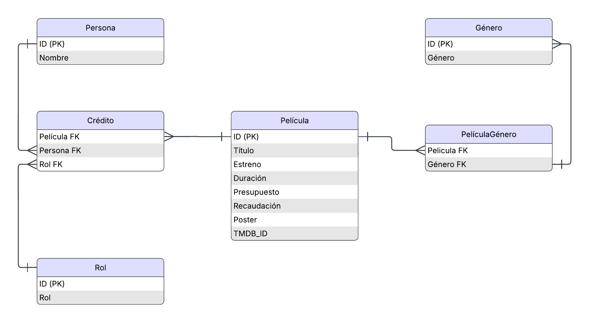

.. role:: python(code)
   :language: python

Bases de Datos
==============

En esta sección nos centraremos en el amacenamiento de datos utilizando
sistemas de bases de datos relacionales :cite:`codd1990relational` y no
relacionales :cite:`strauch2011nosql`. Estos sistemas son de vital importancia
para el desarrollo de aplicaciones, ya que la mayoría de ellas requiere una
gestión de datos escalable, eficiente y segura.

Elegir entre una base de datos relacional o no relacional depende del tipo de
aplicación que estemos desarrollando: Los sistemas relacionales como
*PostgreSQL* :cite:`stonebraker1991postgres`, *MySQL*
:cite:`grippa2021learning` o *Oracle* :cite:`greenwald2013oracle`, ofrecen un
esquema estructurado y formal que ofrece integridad y consistencia de los
datos, además de contar con un lenguaje estándar como SQL que nos permite hacer
consultas complejas de manera eficiente. Por otro lado, los sistemas no
relacionaes como *MongoDB* :cite:`banker2016mongodb` o *Redis*
:cite:`eddelbuettel2022brief`, aportan flexibilidad en el manejo de estructuras
de datos heterogéneas y una escalabilidad superior, lo que los hace
especialmente adecuados para aplicaciones distribuidas con una gran demanda.

.. list-table:: Comparación entre bases de datos relacionales y no relacionales
   :widths: 25 35 40
   :header-rows: 1

   * - Característica
     - Relacional (SQL)
     - No Relacional (NoSQL)
   * - Ejemplos
     - PostgreSQL, MySQL, Oracle
     - MongoDB, Redis
   * - Modelo de datos
     - Tablas con esquemas rígidos
     - Documentos, clave-valor, documentos, gráfos, etc.
   * - Lenguaje de consulta
     - SQL
     - Específico de cada sistema
   * - Consistencia
     - Alta (ACID)
     - Eventual o configurable (BASE)
   * - Escalabilidad
     - Vertical
     - Horizontal
   * - Adecuado para
     - Transacciones, reportes, ERP
     - Big Data, IoT, aplicaciones web modernas
   * - Flexibilidad del esquema
     - Baja
     - Alta

Python cuenta con un ecosistema maduro de bibliotecas que permiten la
comunicación con diversos sistemas gestores de bases de datos.  En las
siguientes secciones, se presentarán ejemplos prácticos de uso para diferentes
tipos de gestores, tanto relacionales como no relacionales.

Bases de Datos relacionales
***************************

Al igual que otros lenguajes, Python cuenta con una especificación estándar que
deben seguir los desarrolladores de APIs para que los desarrolladores puedan
interactuar con bases de datos sin preocuparse de los detalles específicos del
sistema de base de datos.  Si ya haz desarrollado aplicaciones de datos en
otros lenguajes probablemente haz utilizado librerías que siguen un estándar
como ODBC (Open Database Connectivity), JDBC (Java Database Connectivity) o
ADO.NET. Python por su parte cuenta con el Python Database API Specification
v2.0 (PEP 249), dónde se especifica una interfaz estándar para conectar
aplicaciones Python con sistemas de bases de datos relacionales.  Antes de
entrar a los detalles veamos los componentes principales del estándar:

**1. Constructores**

Antes de empezar a interactuar con un servidor de base de datos, debemos
establecer una conexión, normalmente utilizamon una cadena dónde enviamos
los datos específicos de la conexión y una vez establecida la conexión nos
regresa un objecto que representa una conexión específica.

**2. Conexión**

Una conexión es un objeto de la clase :python:`Connection` la cual
contiene métodos para interactuar a nivel alto con el servidor:

:python:`cursor()` Crea un cursor con el cual podemos hacer consultas o enviar comandos de SQL al servidor.

:python:`commit()` Compromete los cambios hechos por la transacción actual.

:python:`rollback()` Deshace los cambios hechos por la transacción actual.

:python:`close()` Cierra la conexión.

**3. Cursor**

Un cursor incluye los siguientes métodos:

:python:`execute(sql, params)` ejecuta una consulta, envía los parámetros de la consulta por separado.

:python:`executemany(sql, seq_of_params)` ejecuta varias consultas.

:python:`fetchone()` devuelve un registro solamente.

:python:`fetchall()` devuelve todos los registros.

:python:`fetchmany(size)` devuelve un número específico de registros.

Atributos:

:python:`description` información de los campos del resultado.

:python:`rowcount` número de registros afectados por la última operación

**4. Tipos de datos**

La especificación del API también incluye tipos de datos estándar en una
base de datos:

- ``Date``, ``Time``, ``Timestamp``

- ``Binary``

- ``STRING``, ``NUMBER``, ``DATETIME``, ``ROWID`` (como constantes tipo)

Cada módulo debe implementar funciones para convertir entre los tipos de Python y los de SQL.

**5. Excepciones**

Se define una jerarquía de excepciones estándar:

.. code-block:: bash

   Exception
   |__Warning
   |__Error
      |__InterfaceError
      |__DatabaseError
         |__DataError
         |__OperationalError
         |__IntegrityError
         |__InternalError
         |__ProgrammingError
         |__NotSupportedError

Todos los módulos deben lanzar estas excepciones específicas para facilitar la portabilidad del código.

Base de Datos de Películas
^^^^^^^^^^^^^^^^^^^^^^^^^^^

Como ejemplo de base de datos, utilizaremos un esquema relacional para
almacenar información sobre películas. Podríamos basarnos en este ejemplo para
programar alguna aplicación del tema, pero por ahora, el objetivo principal es
ejemplificar el uso del lenguaje.

El modelo índica que una persona (``Persona``) puede tener varios roles
(``Rol``) en una película (``Película``) . Por ejemplo, el director de una
película, también puede ser el productor o e incluso uno de los actores, para
establecer esta relación tripartita se crea la entidad ``Credito``.  Además, una
película puede pertenecer a varios géneros.  La información de las películas se
pueden extraer de la plataforma "TMDB"

Veamos ejemplos para SQLite y PostgreSQL:

SQLite
******

SQLite es un sistema relacional de bases de datos extremadamente ligero,
implementado como una librería en C que puede ser embebida en un
proceso, como por ejemplo, un programa escrito en Python.

No requiere configuración, ni opera como un servidor independiente. Sin
embargo, a pesar de su simplicidad, ofrece un alto rendimiento y soporte
completo de transacciones **ACID** :cite:`vossen2009acid`. La base de datos se
puede almacenar en un solo archivo y su licencia de dominio público la hace
ideal para ambiéntes académicos, pero también profesionales. Como se ejecuta en
móviles y navegadores web, se considera ampleamente como el sistema de bases de
datos más instalado en el mundo.

La librería estándar de Python incluye el módulo :python:`sqlite3` que implementa
el DB API 2.0 visto anteriormente. Como no tiene un proceso independiente
utilizado como servidor y la base de datos es solemante un archivo, no requerimos
instalar nada y solamente nos "conectamos" pasando como argumento el nombre del
archivo con el que vamos a trabajar:

>>> import sqlite3 as sql
>>> con = sql.connect("movies.sqlite")

Antes de crear nuestra primera tabla, es importante conocer los tipos de datos
de SQLite. SQLite es muy flexible en cuanto a los tipos de dato que utiliza e
incluso es opcional indicar el tipo de dato. Es parecida a Python en el sentido
de que el tipo de dato no se estipula a nivel de la columna, es más bien
flexible y se almacena junto con cada valor. Sin embargo para la versión 3.37
es posible indicar tipos de datos estríctos. Los tipos de datos de
almacenamiento de SQLite son los siguientes:

  - **NULL**. El valor nulo.
  - **INTEGER**. Entero con signo; el tamaño en bytes varía según el valor.
  - **REAL**. Número flotante IEEE de 8 bytes.
  - **TEXT**. Cadena de texto almacenada como UTF-8, UTF-16BE o UTF-16LE.
  - **BLOB**. Objeto binario almacenado tal cual se ingresó.

Las fechas y hora se almacenan como:
- **TEXT** como cadenas en ISO8601 ("YYYY-MM-DD HH:MM:SS.SSS").
- **REAL** usando el número Juliano, el número de días desde el mediodía del 24 de Noviembre del 4714 B.C.
- **INTEGER** como tiempo de Unix, (segundos desde 1970-01-01 00:00:00 UTC).

En SQLite, las fechas no tienen un tipo nativo; su interpretación depende de la
aplicación. Al crear una tabla podemos indicar los tipos de datos en SQL
estándar o utilizando algunas restricciones, por ejemplo: ``VARCHAR(255)``,
SQLite ignorará la restricción de longitud ``(255)`` y lo tratará como el tipo
de dato ``TEXT``.

.. literalinclude:: movies.sql
  :language: sql
  :linenos:
  :caption: Script con los comandos de SQL para crear el esquema: ``movies.sql``

Vamos a cargar el script utilizando python:

.. code-block:: python

  >>> import sqlite3 as sql
  >>> con = sql.connect("movies.sqlite")
  >>> with open('.\\docs\\source\\movies.sql', 'r') as f:
  ...     sql_script = f.read()
  ...
  >>> cursor = con.cursor()
  >>> cursor.executescript(sql_script)
  <sqlite3.Cursor object at 0x00000175F2123CC0>
  >>> con.commit()
  >>> con.close()

Para cargar el archivo utilizamos el método :python:`open()` para abrir el
script. Ajusta la ruta si estás en otro sistema operativo o estructura de
carpetas. En el ejemplo ejecutamos el script con el método
:python:`cursor.executescript(script)`.

El script agrega la información de dos películas:

  - https://www.themoviedb.org/movie/429-il-buono-il-brutto-il-cattivo
  - https://www.themoviedb.org/movie/496243

Si utilizas un editor de texto como Visual Studio Code, puedes instalar un
**``plug-in`** para visualizar la base de datos que hemos creado. Por ejemplo,
el SQLite Viwer de Forian Klampfer.

Una vez creada la base de datos, podemos conectarnos y hacer consultas
utilizando el :python:`cursor.execute()`. El **cursor** ahora si contiene
elementos ya que el comando es una consulta ``SELECT`` y puede regresar ciertos
datos. Podemos iterar el cursor recuperando un registro a la vez con el método
:python:`fetchone()`.

>>> res = cursor.execute("SELECT * FROM PERSONA");
>>> res.fetchone()
(190, 'Clint Eastwood')
>>> res.fetchone()
(3265, 'Eli Wallach')

También podemos leer el resultado de la consulta en su totalidad, consumiendo
todo el iterador:

>>> import sqlite3 as sql
>>> con = sql.connect("movies.sqlite")
>>> cursor = con.cursor()
>>> res = cursor.execute("SELECT * FROM PERSONA");
>>> res.fetchall() # Resultados recortados por espacio:
[(190, 'Clint Eastwood'), (3265, 'Eli Wallach'), (4078, 'Lee Van Cleef'), (1442583, 'Park So-dam')]
>>> res.fetchall() # El iterador ya se consumió en su totalidad
[]

Otra operación básica es la inserción de nuevos registros, que se realiza
utilizando la sentencia SQL INSERT INTO.  Un aspecto importante a considerar es
la forma en que construimos la consulta a partir de marcadores de posición en
lugar de concatenar cadenas directamente.  Esta técnica no solo facilita el
manejo de valores dinámicos, sino que también previene ataques de inyección SQL
(SQL Injection), ya que ``sqlite3`` se encarga de validar y
escapar los valores proporcionados antes de ejecutar el comando.

Veamos un ejemplo de inserción utilizando una consulta parametrizada:

>>> cursor.execute("INSERT INTO PERSONA (ID, NOMBRE) VALUES (?, ?)", (999, "Nuevo Actor"))
<sqlite3.Cursor object at 0x00000248C990C840>
>>> con.commit()

Notamos que se usan signos de interrogación (?) como marcadores de posición, y
los valores se pasan como una tupla.

Si tenemos varios registros se puede utilizar ``executemany()``:

>>> personas = [(1001, "Leonardo DiCaprio"), (1002, "Brad Pitt")]
>>> cursor.executemany("INSERT INTO PERSONA (ID, NOMBRE) VALUES (?, ?)", personas)
<sqlite3.Cursor object at 0x00000248C990C840>
>>> con.commit()

Podemos encapsular los comandos en funciones para mejorar la estructura de
nuestro programa:

>>> def conectar_db(nombre_archivo):
...     return sql.connect(nombre_archivo)
...
>>> def insertar_persona(con, persona_id, nombre):
...     cur = con.cursor()
...     cur.execute("INSERT INTO PERSONA (ID, NOMBRE) VALUES (?, ?)", (persona_id, nombre))
...     con.commit()
...
>>> con = conectar_db("movies.sqlite")
>>> insertar_persona(con, 138, "Quentin Tarantino")
>>> con.close()

En este caso la conexión se establece solo una vez al principio del programa
y se reutiliza enviando la referencia a los distintos métodos que
operan sobre nuestros datos.

Al enviar comandos a un sistema de bases de datos, estos se ejecutan en el
contexto de una transacción, la cual debe completarse en su totalidad o
revertirse completamente en caso de error.  Una transacción es, por definición,
atómica: todas las operaciones que contiene deben realizarse con éxito; de lo
contrario, deben deshacerse como si nunca hubieran ocurrido.

En caso de que se produzca un error durante la ejecución de alguna operación,
podemos revertir los cambios explícitamente utilizando el comando ROLLBACK. Si
todas las operaciones se ejecutan correctamente, debemos confirmar los cambios
con el comando ``COMMIT``.

En Python, podemos utilizar el objeto :python:`Connection` como un gestor de contexto
(with) para manejar transacciones de forma automática.  En este modo, si el
bloque with finaliza sin excepciones, se envía automáticamente un ``COMMIT``.  En
caso de que ocurra una excepción o el commit falle, la transacción se revierte
automáticamente mediante un ``ROLLBACK``.

.. code-block:: python
  :linenos:
  :caption: Gestión contextual utilizando un objeto tipo :python:`Connection`

  con = sqlite3.connect(":memory:") # Creamos la base de datos en memoria

  # Creamos una nueva tabla PERSONA,  con una restricción UNIQUE
  con.execute("CREATE TABLE PERSONA(id INTEGER PRIMARY KEY, nombre VARCHAR UNIQUE)")

  # Si hay exito automáticamente se llama con.commit()
  with con:
      con.execute("INSERT INTO Persona(nombre) VALUES(?)", ("Leonardo DiCaprio",))

  # Se ejecuta con.rollback() si el bloque termina debido a una excepción,
  # debemos atrapar la excepción
  try:
      with con:
          con.execute("INSERT INTO Persona(nombre) VALUES(?)", ("Leonardo DiCaprio",))
  except sqlite3.IntegrityError:
      print("couldn't add Python twice")

  # El objecto ``Connection`` utilizado solo compromete o deshace transacciones, no
  # cierra la conexión
  con.close()

Resumen de capítulo
-------------------

En este capítulo revisamos el papel de los sistemas de bases de datos en el
desarrollo de aplicaciones modernas, comparando enfoques **relacionales (SQL)**
y **no relacionales (NoSQL)**, así como los criterios prácticos para elegir
entre ambos.

Posteriormente introdujimos el estándar **Python DB-API 2.0 (PEP 249)**,
explicando sus componentes principales: conexiones, cursores, transacciones,
tipos de datos y jerarquía de excepciones. Con esta base, trabajamos un ejemplo
con **SQLite**, un motor relacional ligero integrado en la biblioteca estándar,
con el que construimos y consultamos una base de datos de películas.

Finalmente, mostramos buenas prácticas esenciales al interactuar con bases de
datos desde Python: uso de consultas parametrizadas para prevenir inyección SQL,
y manejo correcto de transacciones mediante ``commit()``, ``rollback()`` y el uso
de ``Connection`` como gestor de contexto con ``with``.

.. 
    PostgreSQL
    ^^^^^^^^^^

    No SQL
    *******

    Redis
    ^^^^^

    MongoDB
    ^^^^^^^

