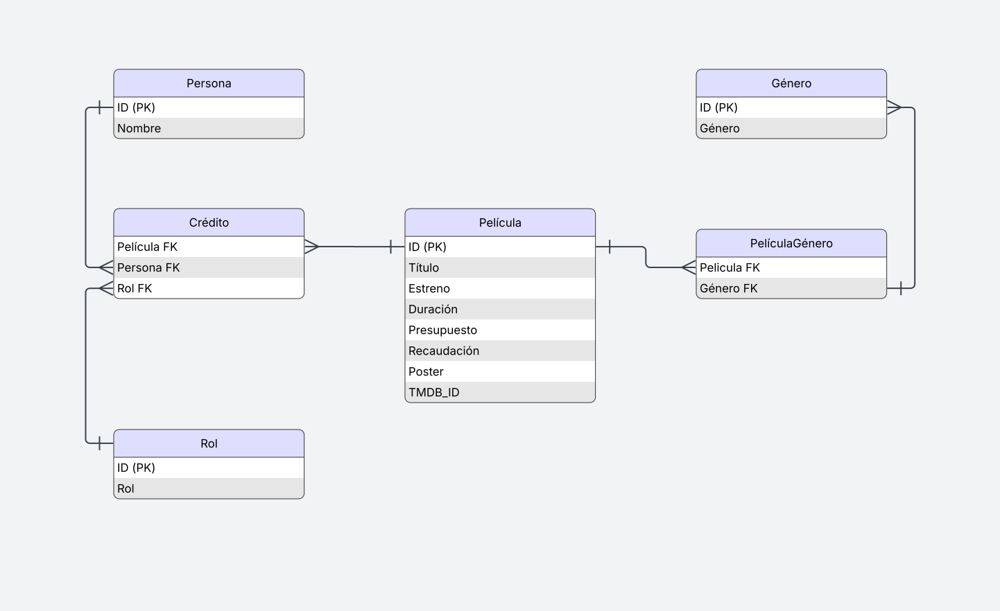

.. role:: python(code)
   :language: python

Bases de Datos
==============

En esta sección nos centraremos en el amacenamiento de
datos utilizando servicios de sistemas de bases de datos relacionales y
no relacionales. Estos sistemas son de vital importancia para
el desarrollo de aplicaciones, ya que la mayoría de ellas requiere una gestión
de datos escalable, eficiente y segura.

Elegir entre una base de datos relacional o no relacional depende del tipo de
aplicación que estemos desarrollando: Los sistemas relacionales como *PostgreSQL*, *MySQL* o *Oracle*, ofrecen un
esquema estructurado y formal que ofrece integridad y consistencia de los datos,
además de contar con un lenguaje estándar como SQL que nos permite hacer
consultas complejas de manera eficiente. Por otro lado, los sistemas no
relacionaes como *MongoDB* o *Redis*, aportan flexibilidad en el manejo de estructuras de datos
heterogéneas y una escalabilidad superior, lo que los hace especialmente
adecuados para aplicaciones distribuidas con una gran demanda.

.. list-table:: Comparación entre bases de datos relacionales y no relacionales
   :widths: 25 35 40
   :header-rows: 1

   * - Característica
     - Relacional (SQL)
     - No Relacional (NoSQL)
   * - Ejemplos
     - PostgreSQL, MySQL, Oracle
     - MongoDB, Redis
   * - Modelo de datos
     - Tablas con esquemas rígidos
     - Documentos, clave-valor, documentos, gráfos, etc.
   * - Lenguaje de consulta
     - SQL
     - Específico de cada sistema
   * - Consistencia
     - Alta (ACID)
     - Eventual o configurable (BASE)
   * - Escalabilidad
     - Vertical
     - Horizontal
   * - Adecuado para
     - Transacciones, reportes, ERP
     - Big Data, IoT, aplicaciones web modernas
   * - Flexibilidad del esquema
     - Baja
     - Alta

Python cuenta con un ecosistema maduro de bibliotecas que permiten la
comunicación con diversos sistemas gestores de bases de datos.  En las
siguientes secciones, se presentarán ejemplos prácticos de uso para diferentes
tipos de gestores, tanto relacionales como no relacionales

Bases de Datos relacionales
***************************

Al igual que otros lenguajes, Python cuenta con una especificación estándar que
deben seguir los desarrolladores de APIs para que los desarrolladores puedan
interactuar con bases de datos sin preocuparse de los detalles específicos del
sistema de base de datos.  Si ya haz desarrollado aplicaciones de datos en otros
lenguajes probablemente haz utilizado librerías que siguen un estándar como ODBC
(Open Database Connectivity), JDBC (Java Database Connectivity) o ADO.NET.
Python por su parte cuenta con el Python Database API Specification v2.0 (PEP
249), dónde se especifica una interfaz estándar para conectar aplicaciones
Python con sistemas de bases de datos relacionales.  Antes de ver detalles
especificos veamos los componentes principales del estándar:

**1. Constructores**

Antes de empezar a interactuar con un servidor de base de datos, debemos
establecer una conexión, normalmente utilizamon una cadena dónde enviamos
los datos específicos de la conexión y una vez establecida la conexión nos
regresa un objecto que representa una conexión específica.

**2. Conexión**

Una conexión es un objeto de la clase :python:`Connection` la cual
contiene métodos para interactuar a nivel alto con el servidor:

:python:`cursor()` Crea un cursor con el cual podemos hacer consultas o enviar comandos de SQL al servidor.

:python:`commit()` Compromete los cambios hechos por la transacción actual.

:python:`rollback()` Deshace los cambios hechos por la transacción actual.

:python:`close()` Cierra la conexión.

**3. Cursor**

Un cursor incluye los siguientes métodos:

:python:`execute(sql, params)` ejecuta una consulta, envía los parámetros de la consulta por separado.

:python:`executemany(sql, seq_of_params)` ejecuta varias consultas.

:python:`fetchone()` devuelve un registro solamente.

:python:`fetchall()` devuelve todos los registros.

:python:`fetchmany(size)` devuelve un número específico de registros.

Atributos:

:python:`description` información de los campos del resultado.

:python:`rowcount` número de registros afectados por la última operación

**4. Tipos de datos**

La especificación del API también incluye tipos de datos estándar en una
base de datos:

- ``Date``, ``Time``, ``Timestamp``

- ``Binary``

- ``STRING``, ``NUMBER``, ``DATETIME``, ``ROWID`` (como constantes tipo)

Cada módulo debe implementar funciones para convertir entre los tipos de Python y los de SQL.

**5. Excepciones**

Se define una jerarquía de excepciones estándar:

.. code-block:: bash

   Exception
   |__Warning
   |__Error
      |__InterfaceError
      |__DatabaseError
         |__DataError
         |__OperationalError
         |__IntegrityError
         |__InternalError
         |__ProgrammingError
         |__NotSupportedError

Todos los módulos deben lanzar estas excepciones específicas para facilitar la portabilidad del código.

Base de datos
^^^^^^^^^^^^^

Como ejemplo de la base de datos utilizaremos un esquema relacional para
almacenar información sobre peículas. Este ejemplo se podría tomar  como
base para realizar una aplicación del tema, pero su objetivo principal es ejemplificar
el uso del lenguaje.

El modelo índica que una persona (``Persona``) puede tener varios roles
(``Rol``) en una película (``Película``) . Por ejemplo, el director de una
película, también puede ser el productor o e incluso uno de los actores, para
establecer esta relación tripartita se crea la entidad ``Credito``.  Además, una
película puede pertenecer a varios géneros.  La información de las peliculas se
pueden extraer de la plataforma "TMDB"

Veamos ejemplos para SQLite y PostgreSQL:

SQLite
^^^^^^

SQLite es un sistema relacional de bases de datos extremadamente ligero,
implementado como una librería (escrita en C), que puede ser embedida en un
proceso (por ejemplo, un programa de Python).  No requiere configuración, ni
corre como un servidor. Sin embargo es de alto desempeño e implementa
transacciones. La base de datos se puede almacenar en un solo archivo y su
licencia de dominio público, la hacen ideal para ambiéntes académicos, pero
también profesionales. Como se ejecuta en móviles y navegadores web, se estima
que es el sistema de bases de datos más instalado en el mundo.

La librería estándar de Python incluye el módulo :python:`sqlite` que implementa
el DB API 2.0 visto anteriormente. Como no tiene un proceso independiente
utilizado como servidor y la base de datos es solemante un archivo, no requerimos
instalar nada y solamente nos "conectamos" pasando como argumento el nombre del
archivo con el que vamos a trabajar:

>>> import sqlite3 as sql
>>> con = sql.connect("movies.sqlite")

Antes de crear nuestra primera tabla, hablemos un poco de los tipos de datos
de SQLite. SQLite es muy flexible en cuanto a los tipos de dato que utiliza e incluso
es opcional indicar el tipo de dato. Es parecida a Python en el sentido de que el
tipo de dato no se estipula a nivel de la columna, es más bien flexible y se almacena junto con
cada dato. Sin embargo para la versión 3.37 es posible indicar tipos de datos estríctos.
Los tipos de datos de almacenamiento de SQLite son los siguientes:

  - **NULL**. El valor de NULL.
  - **INTEGER**. Representa un entero con signo y dependiendo de la magnitud del valor se almacena
    utilizando 0, 1, 2, 3, 4, 6 u 8 bytes.
  - **REAL**. Es un valor flotante almacenado como un número flotante IEEE de 8 bits.
  - **TEXT**. Es una cadena de texto, almacenada con un encoding de UTF-8, UTF-16BE o UTF-16LE.
  - **BLOB**. Es un objeto binario almacenado tal cual se ingresó.

Las fechas y hora se almacenan como:
- **TEXT** como cadenas en ISO8601 ("YYYY-MM-DD HH:MM:SS.SSS").
- **REAL** como números del calendario Juliano, el número de días desde el medio díiade del 24 de Noviembre del 4714 B.C.
- **INTEGER** como tiempo de Unix, el número de segundos desde 1970-01-01 00:00:00 UTC.

Las aplicaciones pueden almacenar las fechas utilizando el formato que puedan manipular. Al crear una tabla
podemos indicar los tipos de datos en SQL estándar o utilizando algunas restricciones, por ejemplo: ``VARCHAR(255)``,
SQLite ignorará el ``(255)`` ya que no hace validaciones de este tipo y utilizará el tipo de dato ``TEXT``.

.. literalinclude:: movies.sql
  :language: sql
  :linenos:
  :caption: Script con los comandos de SQL para crear el esquema: ``movies.sql``

Vamos a cargar el script utilizando python:

.. code-block:: python

  >>> import sqlite3 as sql
  >>> con = sql.connect("movies.sqlite")
  >>> with open('.\\docs\\source\\movies.sql', 'r') as f:
  ...     sql_script = f.read()
  ...
  >>> cursor = con.cursor()
  >>> cursor.executescript(sql_script)
  <sqlite3.Cursor object at 0x00000175F2123CC0>
  >>> con.commit()
  >>> con.close()

Para cargar el archivo utilizamos el método :python:`open()` para abrir el script.
Ajusta la ruta que en este ejemplo esta utilizando el separadore de directorios
estilo Windows y la ubicación específica en mi computadora. Se executa el script con
el método :python:`cursor.executemany(script)`.

El script agrega la información de dos películas:

  - https://www.themoviedb.org/movie/429-il-buono-il-brutto-il-cattivo
  - https://www.themoviedb.org/movie/496243

Si utilizas un editor de texto como Visual Studio Code, puedes instalar un **``plug-in`** para
visualizar la base de datos que hemos creado. Por ejemplo, el SQLite Viwer de Forian Klampfer.

Una vez creada la base de datos, podemos conectarnos y hacer consultas utilizanod el :python:`cursor.execute()`.
El **cursor** ahora si contiene elementos ya que el comando es una consulta ``SELECT`` y puede regresar ciertos datos.
Podemos iterar el cursor recuperando un registro a la vez con el método :python:`fetchone()`.

>>> res = cursor.execute("SELECT * FROM PERSONA");
>>> res.fetchone()
(190, 'Clint Eastwood')
>>> res.fetchone()
(3265, 'Eli Wallach')

También podemos leer el resultado de la consulta en su totalidad, consumiendo todo el iterador:

>>> import sqlite3 as sql
>>> con = sql.connect("movies.sqlite")
>>> cursor = con.cursor()
>>> res = cursor.execute("SELECT * FROM PERSONA");
>>> res.fetchall()
[(190, 'Clint Eastwood'), (3265, 'Eli Wallach'), (4078, 'Lee Van Cleef'), (4385, 'Sergio Leone'), (20738, 'Song Kang-ho'), (21684, 'Bong Joon Ho'), (115290, 'Lee Sun-kyun'), (556435, 'Cho Yeo-jeong'), (1255881, 'Choi Woo-shik'), (1442583, 'Park So-dam')]

PostgreSQL
^^^^^^^^^^

No SQL
*******

Redis
^^^^^

MongoDB
^^^^^^^