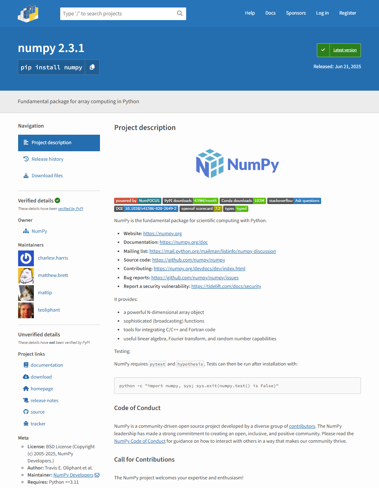

.. role:: python(code)
   :language: python

Ambientes Virtuales
===================

Python es un proyecto de código libre muy popular, lo que significa que muchos
desarroladores talentosos contribuyen a la comunidad de Python desarrollando
librerías y software también con licencias de código abierto. En caso de
necesitar una librería que no se incluya en la distribución actual de Python, es
muy probable que algún desarrollador en algún lugar del mundo ya haya
implementado una buena solución y que otros desarrolladores que utilizan dicha
herramienta colaboren para mantenerla al día. El desarrollo de librerías en
Python también puede tener el apoyo de empresas que invierten recursos para
mantener y agregarles nuevas funcionalidades. Pero, lamentablemente también
puede suceder que alguna librería no tenga suficientes usuarios o no haya tanto
interés en su desarrollo y sufra de abandono.

Los lenguajes modernos incluyen herramientas que permiten a los programadores
compartir fácilmente su código, e incluyen comandos para instalar cierta versión
anterior de una librería, o actualizar la versión actual a una versión más
reciente.  En el caso de Python, el programa preferido de instalación de módulos
es ``pip`` (`pip intalls packages`) ya partir de Python 3.4 se incluye dentro de
la distribución binaria del lenguaje.

Antes de empezar con el uso de ``pip``, vamos conocer otros componentes importantes
del ecosistema:

PyPI es el índice oficial de paquetes de la comunidad de programadores de
Python.  Funciona como un repositorio de acceso abierto que perimte a los
desarrolladores publicar, compartir y reutilizar sus contribuciones de software.

El sitio web principal es https://pypi.org, y es el punto de entrada
para explorar e instalar paquetes mediante herramientas como ``pip``.

El software que da vida a PyPI está construido sobre una plataforma llamada
Warehouse, que es el sistema backend desarrollado por la Python Packaging
Authority (PyPA) el grupo encargado de mantener herramientas como ``pip`` y
``wharehouse``. La plataforma es confiable y se considera en producción.

Como programador puedes iniciar tu búsqueda en el repositorio y ver los
detalles del módulo:

